---
# Please do not edit this file directly; it is auto generated.
# Instead, please edit 08-BMC_R_Day3_A.md in _episodes_rmd/
title: "Visualisation"
subtitle: "Day 3"
author: "Darya Vanichkina, Nick Ho"
start: 2
keypoints:
- ggplot is the best data visualisation package for R 
- it uses the grammar of graphics to generate a plot layer by layer
objectives:
- plot data using ggplot
- use gather() and spread() to correctly prepare the data on the fly to feed into ggplot
questions: How can I visualise my data in R?
source: Rmd
teaching: 60
exercises: 30
---

# Data visualisation

Plotting our data is one of the best ways to quickly explore it and the various relationships between variables.

Today we will use the tidyverse package "ggplot" for visualisation, and learn the `gather()` and `spread()` commands that can help us munge the data, on the fly, so that we can prepare the data to be able to visualise it in ggplot. 

There are three main plotting systems in R, the base plotting system, the lattice package, and the ggplot2 package.

Today we’ll be learning about the ggplot2 package, because it is the most effective for creating publication quality graphics.

ggplot2 is built on the grammar of graphics, the idea that any plot can be expressed from the same set of components: a data set, a coordinate system, and a set of geoms–the visual representation of data points.

The key to understanding ggplot2 is thinking about a figure in layers. 

~~~
# load tidyverse
library(tidyverse)
~~~
{: .language-r}

~~~
── Attaching packages ────────────────────────────────── tidyverse 1.2.1 ──
~~~
{: .output}

~~~
✔ ggplot2 3.1.0     ✔ purrr   0.2.5
✔ tibble  1.4.2     ✔ dplyr   0.7.7
✔ tidyr   0.8.2     ✔ stringr 1.3.1
✔ readr   1.1.1     ✔ forcats 0.3.0
~~~
{: .output}

~~~
── Conflicts ───────────────────────────────────── tidyverse_conflicts() ──
✖ dplyr::filter() masks stats::filter()
✖ dplyr::lag()    masks stats::lag()
~~~
{: .output}

~~~
# read in last lesson's data
autism.data <- read.csv(file = "data/autism_data.csv",
                        header = TRUE,
                        sep = ",",
                        na.strings = "?")

# rename the column with the typo
colnames(autism.data)[17] <- "country"

# make a new column of patient IDs called pids
new_ids <- paste( "PatientID_" , autism.data$id, sep = "")
autism.data$pids <- new_ids

# remove the patient who was 383 years old
autism.data <- autism.data[-which.max(autism.data$age), ]
rm(new_ids)
~~~
{: .language-r}

## Lets start by making a scatterplot of result by age

This uses the familiar pipe syntax:

~~~
autism.data %>% ggplot(aes( x  = age, y = result)) + geom_point()
~~~
{: .language-r}

~~~
Warning: Removed 2 rows containing missing values (geom_point).
~~~
{: .error}

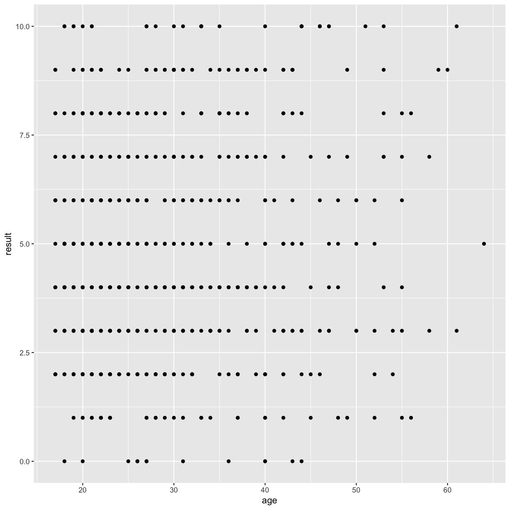

So the first thing we do is call the `ggplot` function. This function lets R know that we’re creating a new plot, and any of the arguments we give the ggplot function are the global options for the plot: they apply to all layers on the plot.

We’ve passed in two arguments to `ggplot`. First, we tell ggplot what data we want to show on our figure, in this example the gapminder data we read in earlier. For the second argument we passed in the aes function, which tells ggplot how variables in the data map to aesthetic properties of the figure, in this case the x and y locations. Here we told ggplot we want to plot the "age" column of the autism.data data frame on the x-axis, and the "result" column on the y-axis. Notice that we didn’t need to explicitly pass aes these columns (e.g. x = autism.data$age), this is because ggplot is smart enough to know to look in the data for that column!

By itself, the call to ggplot isn’t enough to draw a figure:

~~~
autism.data %>% ggplot(aes( x  = age, y = result))
~~~
{: .language-r}

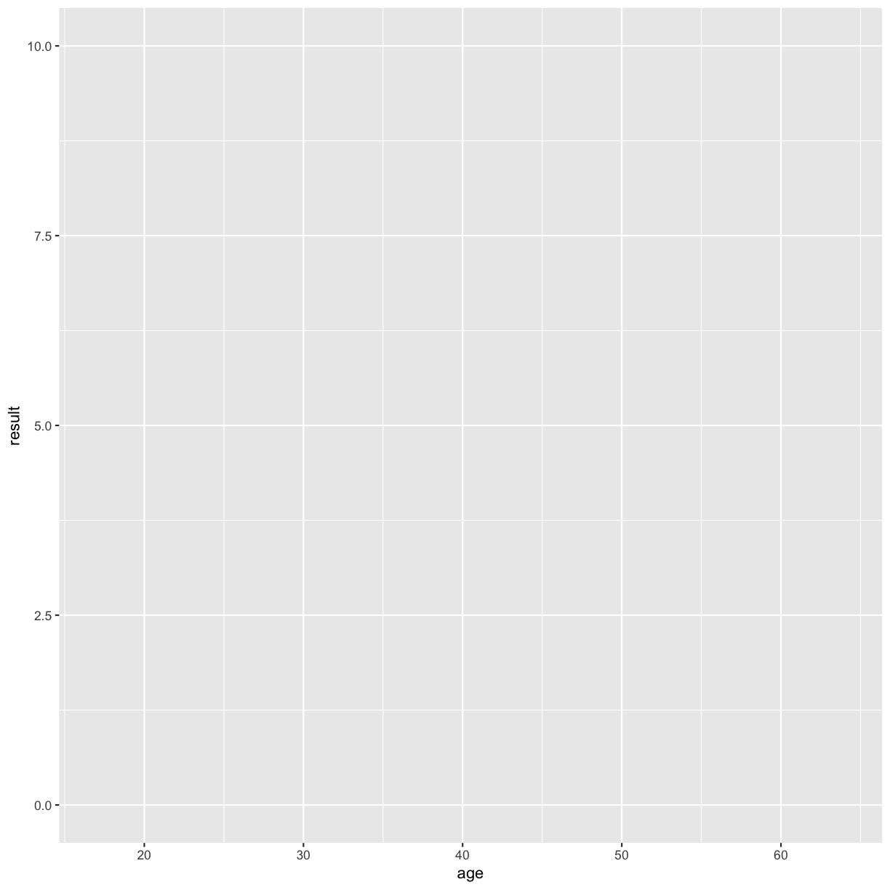

We need to tell ggplot how we want to visually represent the data, which we do by adding a new geom layer. In our example, we used geom_point, which tells ggplot we want to visually represent the relationship between x and y as a scatterplot of points:

~~~
autism.data %>% ggplot(aes( x  = age, y = result)) + geom_point()
~~~
{: .language-r}

~~~
Warning: Removed 2 rows containing missing values (geom_point).
~~~
{: .error}

I'll immediately show you how to make it prettier using themes (a "top" layer), just so the rest of the plots in our workshop don't have this rather odd grey background. 

~~~
autism.data %>% ggplot(aes( x  = age, y = result)) + geom_point() + theme_bw()
~~~
{: .language-r}

~~~
Warning: Removed 2 rows containing missing values (geom_point).
~~~
{: .error}

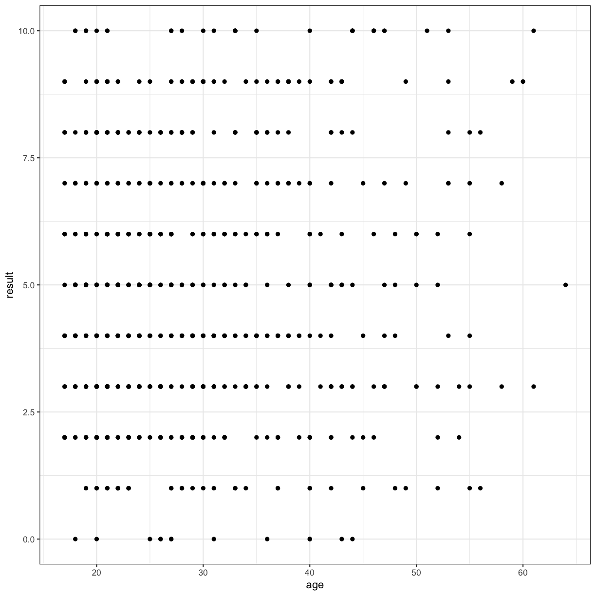

> ## Micro-challenge
>
> Another aesthetic property we can modify is the point color. 
>
> Modify the code above to color the points by Class.ASD”. What trends do you see in the data? Are they what you expected?
> 
> {: .source}
>
> > ## Solution
> >
> > Use the aesthetic "col" or "color" or "colour" to plot Class.ASD
> > 
> > ~~~
> > autism.data %>% ggplot(aes( x  = age, y = result, col = Class.ASD)) + geom_point() + theme_bw()
> > ~~~
> > {: .output}
> {: .solution}
{: .challenge}

## Boxplots

One of the most useful ways of visualising data in science is using boxplots. 

~~~
autism.data %>% ggplot(aes(x = gender, y = result)) + geom_boxplot() + theme_bw()
~~~
{: .language-r}

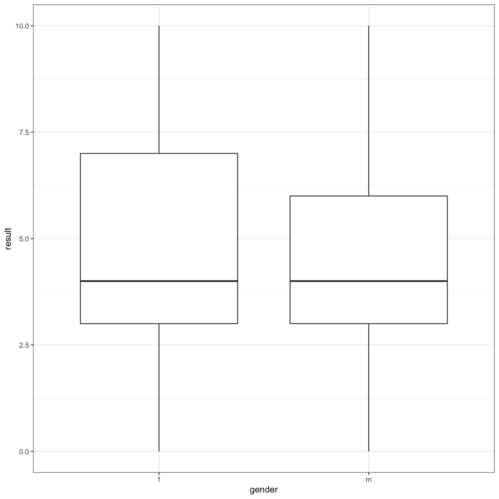

~~~
# we can also use colour
autism.data %>% ggplot(aes(x = gender, y = result, col = gender)) + geom_boxplot() + theme_bw()
~~~
{: .language-r}

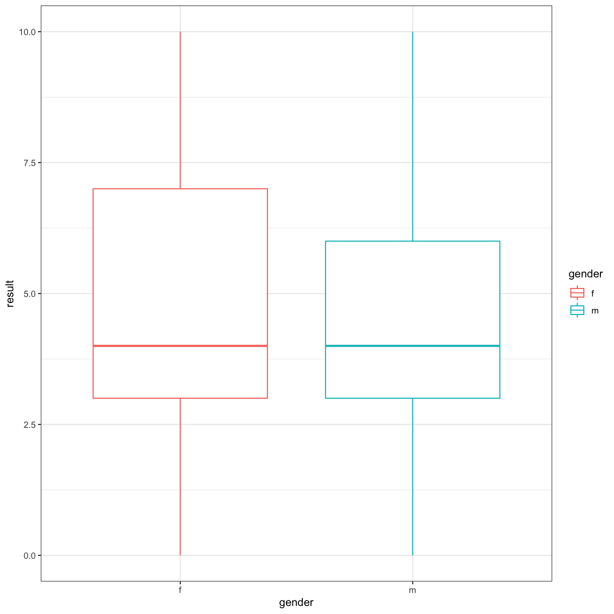

~~~
# there is also the idea about fill
autism.data %>% ggplot(aes(x = gender, y = result, fill = gender)) + geom_boxplot() + theme_bw()
~~~
{: .language-r}

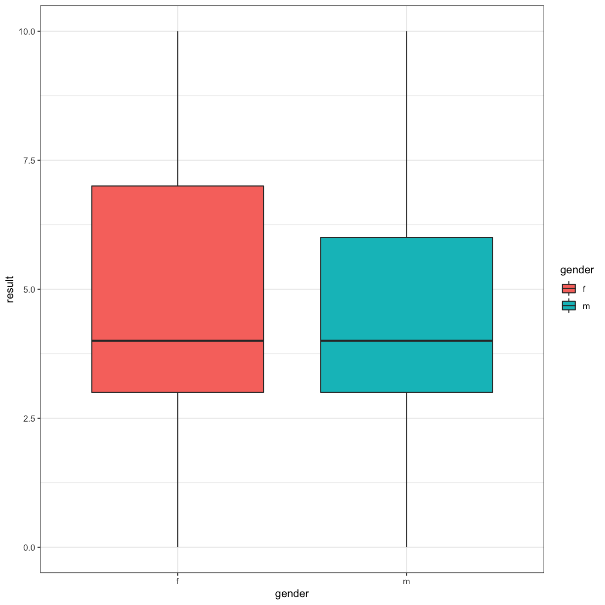

Depending on what we're trying to do, a violin plot can also be informative:

~~~
autism.data %>% ggplot(aes(x = gender, y = result, fill = gender)) + geom_violin() + theme_bw()
~~~
{: .language-r}

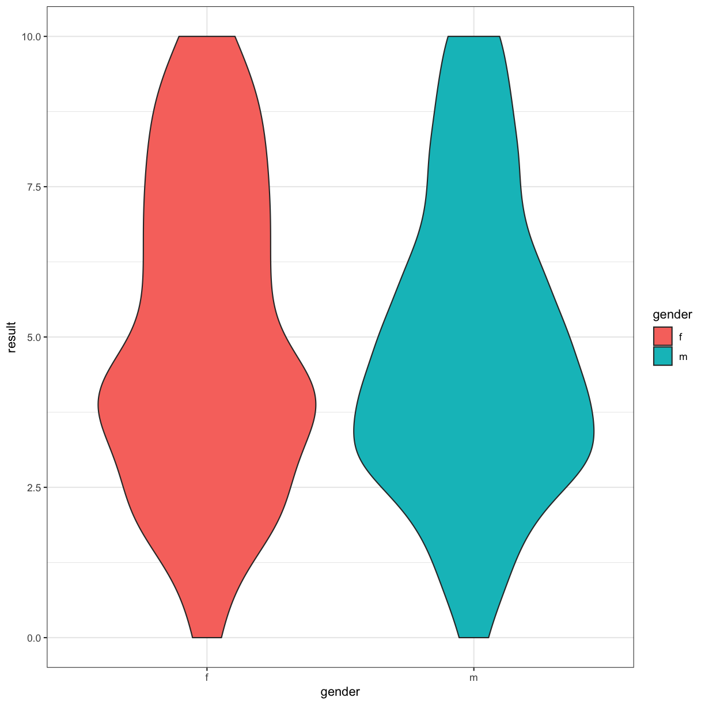

Another commonly used visualisation is a barplot (think Excel):

~~~
autism.data %>% ggplot(aes(x = result)) + geom_bar() + theme_bw()
~~~
{: .language-r}

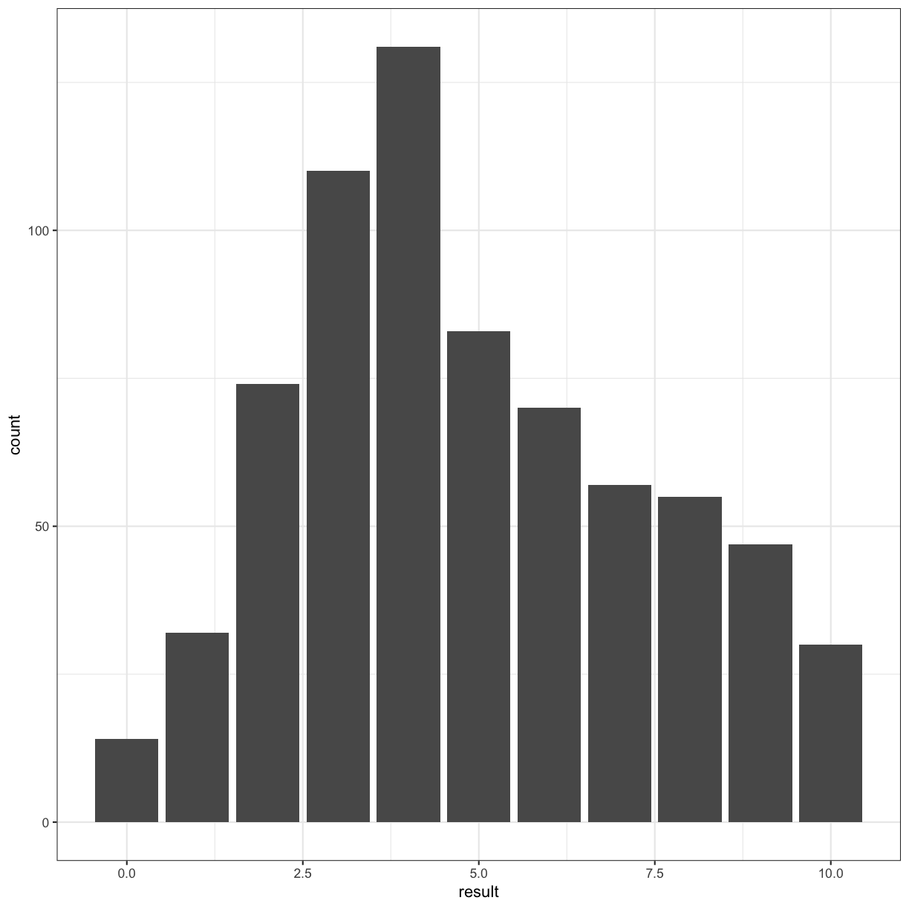

Incidentally, this looks like a histogram:

~~~
autism.data %>% ggplot(aes(x = result )) + geom_histogram() + theme_bw()
~~~
{: .language-r}
Fix the error

~~~
# fix the error
autism.data %>% ggplot(aes(x = as.factor(result) )) + geom_histogram(stat = "count") + theme_bw()
~~~
{: .language-r}

~~~
Warning: Ignoring unknown parameters: binwidth, bins, pad
~~~
{: .error}

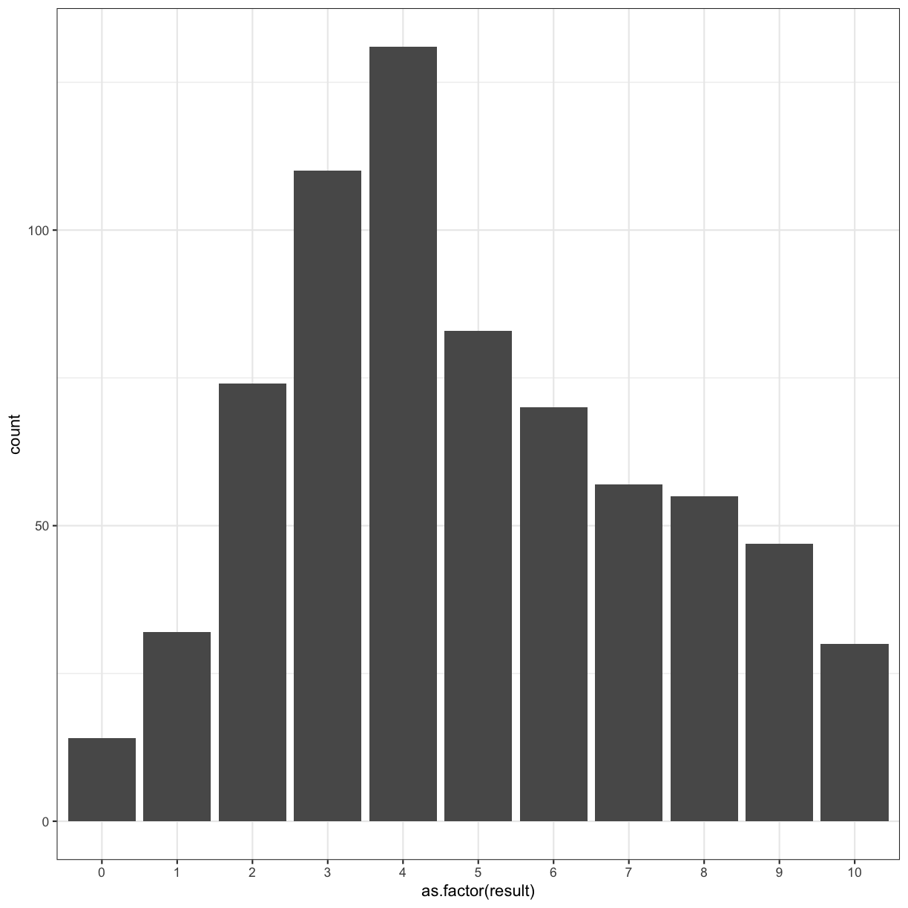

Going back to our original bar chart approach, we can use colour to highlight another facet of our data:

~~~
autism.data %>% ggplot(aes(x = result, fill = gender )) + geom_bar() + theme_bw()
~~~
{: .language-r}

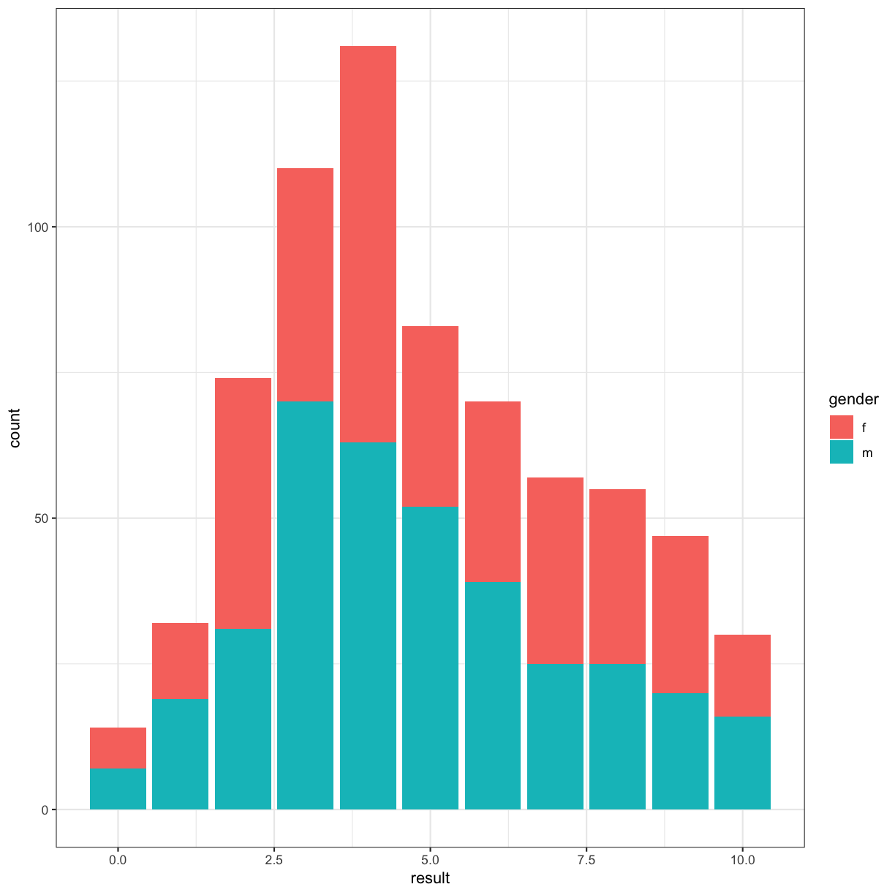

> ## Micro-challenge
>
> Make a barplot of the age of the autism.data participants, using color and fill to represent Class.ASD and gender.
> Is this a good visualisation? What could we do to make it better?
> 
> {: .source}
>
> > ## Solution
> >
> > This plot looks horrible
> > ~~~
> > autism.data %>% ggplot(aes(x = age, col = gender, fill = Class.ASD )) + geom_bar() + theme_bw()
> > ~~~
> > {: .output}
> {: .solution}
{: .challenge}

## Color scales and the RColorBrewer package

~~~
library(RColorBrewer)
autism.data %>% ggplot(aes(x = age, col = gender, fill = Class.ASD )) + geom_bar() + scale_colour_brewer(palette = "Set1") + scale_fill_brewer(palette = "Set2") + theme_minimal()
~~~
{: .language-r}

~~~
Warning: Removed 2 rows containing non-finite values (stat_count).
~~~
{: .error}

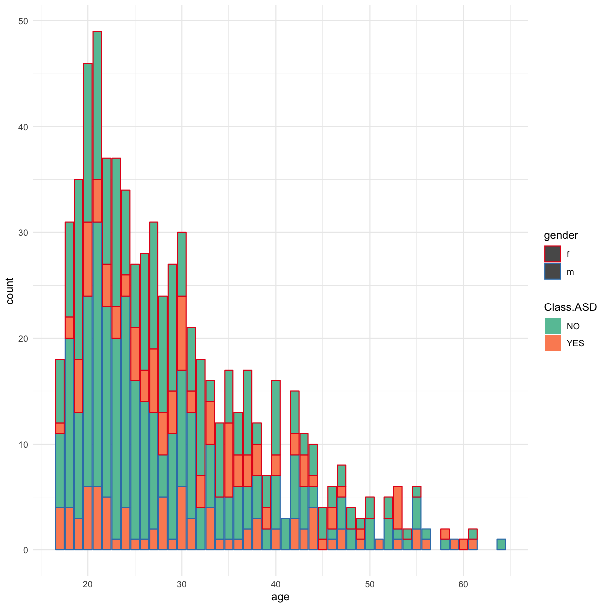

We can use the RColorBrewer [library](https://moderndata.plot.ly/create-colorful-graphs-in-r-with-rcolorbrewer-and-plotly/) and [Colorbrewer](http://colorbrewer2.org) websites to choose the best pallete for displaying our data and presenting it... but this still looks horrible...

The real problem we're facing is that we want to "re-format" our data to slice it in a different way than we have previously - to generate a new factor column with four possible levels:
- gender == "f" and Class.ASD == "NO"
- gender == "f" and Class.ASD == "YES"
- gender == "m" and Class.ASD == "NO"
- gender == "m" and Class.ASD == "YES"

Lets try to use `mutate()`  to do this...

~~~
autism.data %>% mutate(NewCol = paste(gender, Class.ASD, sep = "_")) %>% ggplot(aes(x = age, fill = NewCol )) + geom_bar() + scale_fill_brewer(palette = "Set2") + theme_minimal()
~~~
{: .language-r}

~~~
Warning: Removed 2 rows containing non-finite values (stat_count).
~~~
{: .error}

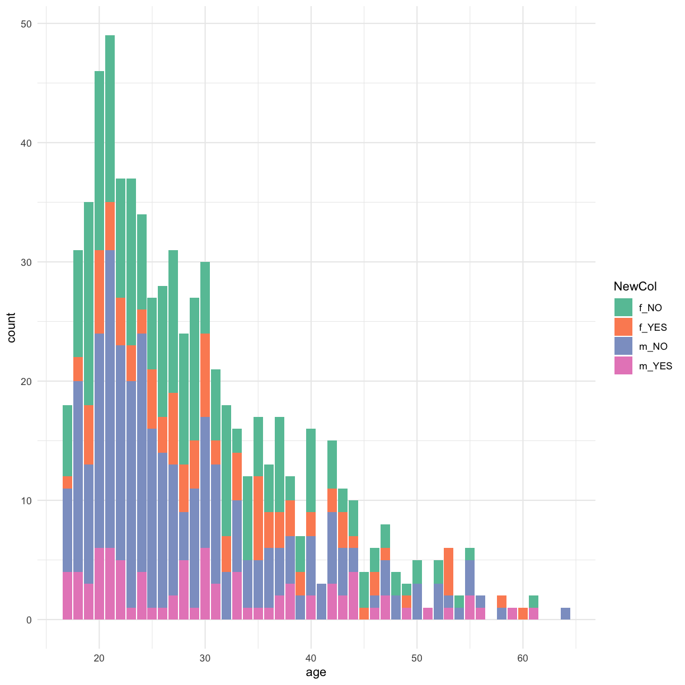

# Transformations and statistics
ggplot2 also makes it easy to overlay statistical models over the data.

~~~
ggplot(data = autism.data, aes(x = age, y = result, color=gender)) + geom_point() + theme_minimal()
~~~
{: .language-r}

~~~
Warning: Removed 2 rows containing missing values (geom_point).
~~~
{: .error}

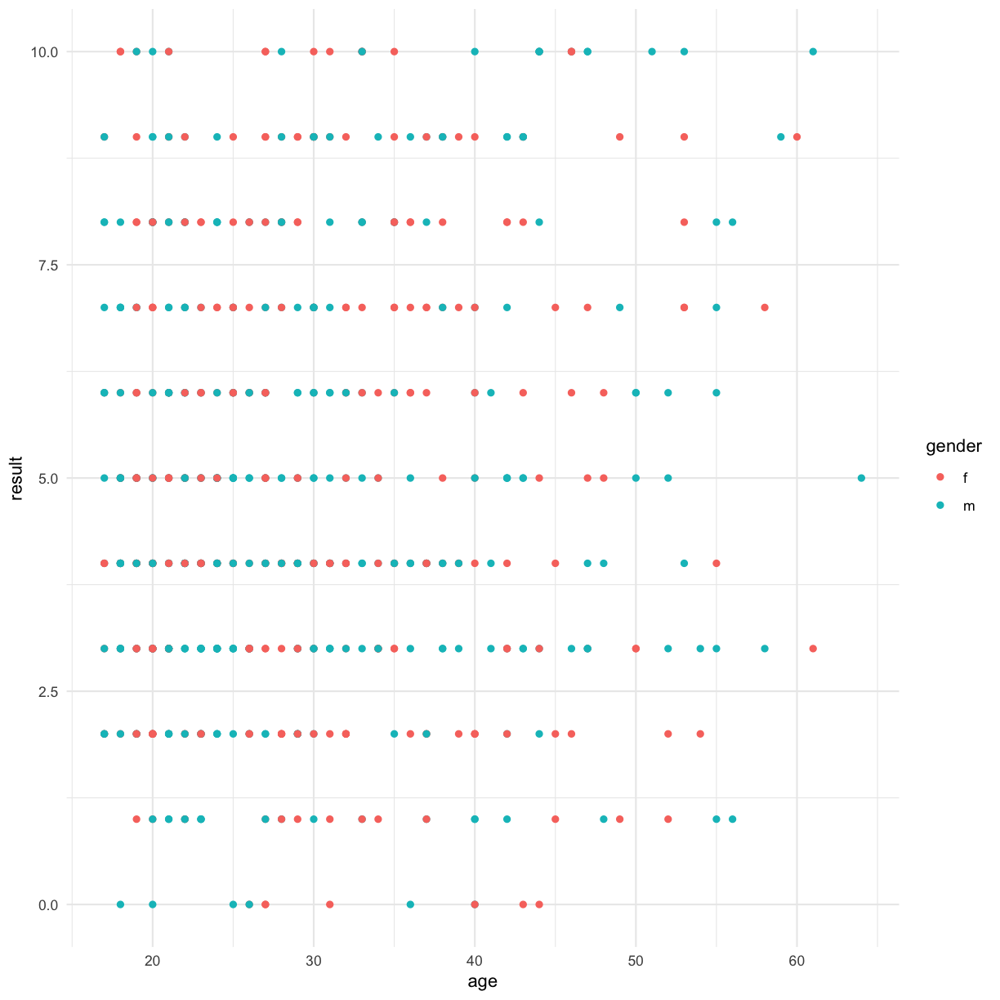

This doesn't make sense for this data, but we can log-scale the age, for example:

~~~
ggplot(data = autism.data, aes(x = age, y = result, color=gender)) + geom_point() + scale_x_log10() + theme_minimal()
~~~
{: .language-r}

~~~
Warning: Removed 2 rows containing missing values (geom_point).
~~~
{: .error}

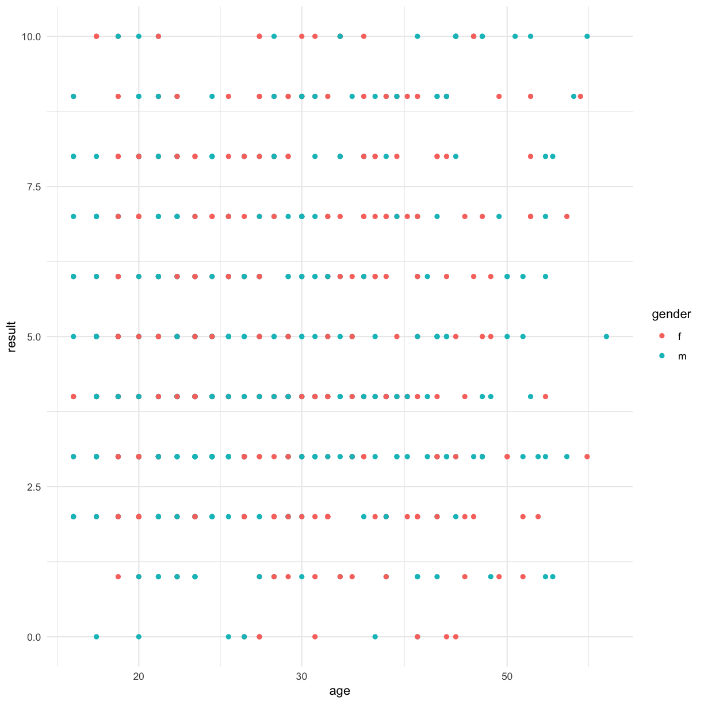

We can also use transparency to see if any points are overlaid:

~~~
ggplot(data = autism.data, aes(x = age, y = result, color=gender)) + geom_point(alpha = 0.7) + theme_minimal()
~~~
{: .language-r}

~~~
Warning: Removed 2 rows containing missing values (geom_point).
~~~
{: .error}

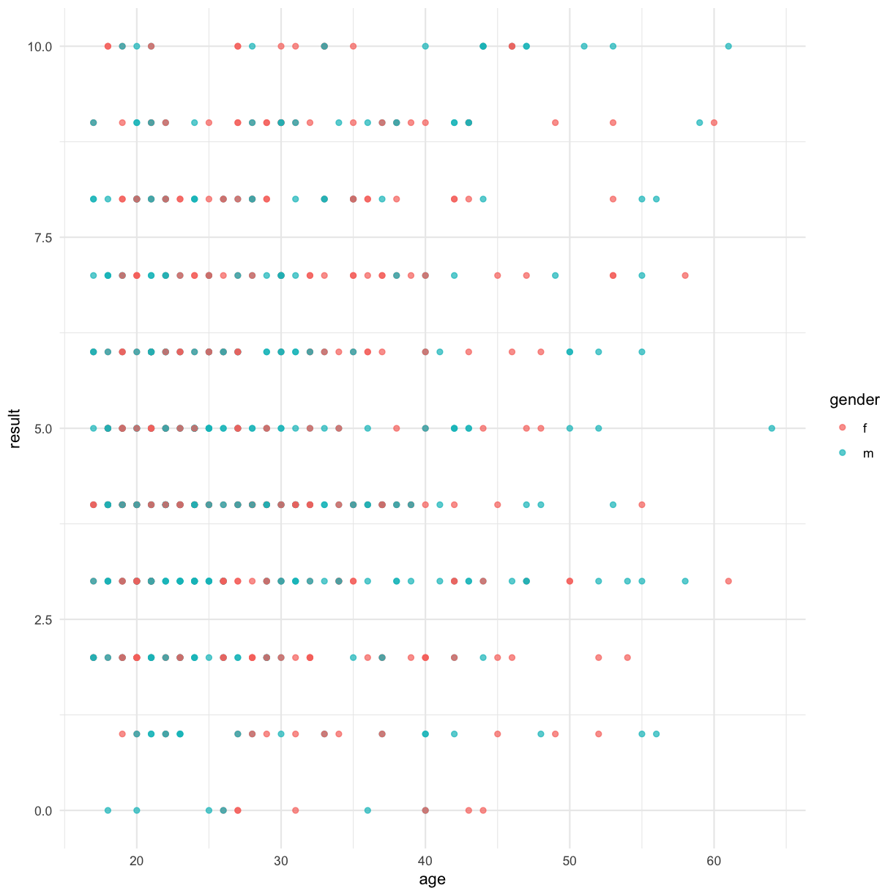
An alternative that is sometimes more effective involves using jitter:

~~~
ggplot(data = autism.data, aes(x = age, y = result, color=gender)) + geom_jitter() + theme_minimal()
~~~
{: .language-r}

~~~
Warning: Removed 2 rows containing missing values (geom_point).
~~~
{: .error}

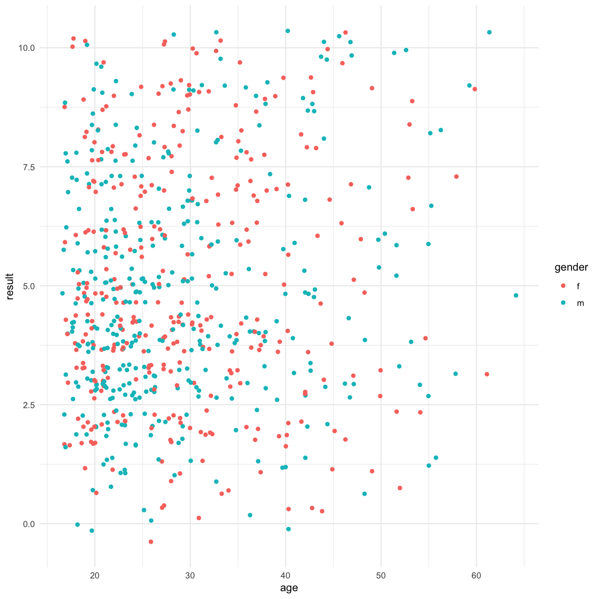
We can adjust the jitter:

~~~
ggplot(data = autism.data, aes(x = age, y = result, color=gender)) + geom_jitter(height = 0.3, width = 0.2) + theme_minimal()
~~~
{: .language-r}

~~~
Warning: Removed 2 rows containing missing values (geom_point).
~~~
{: .error}

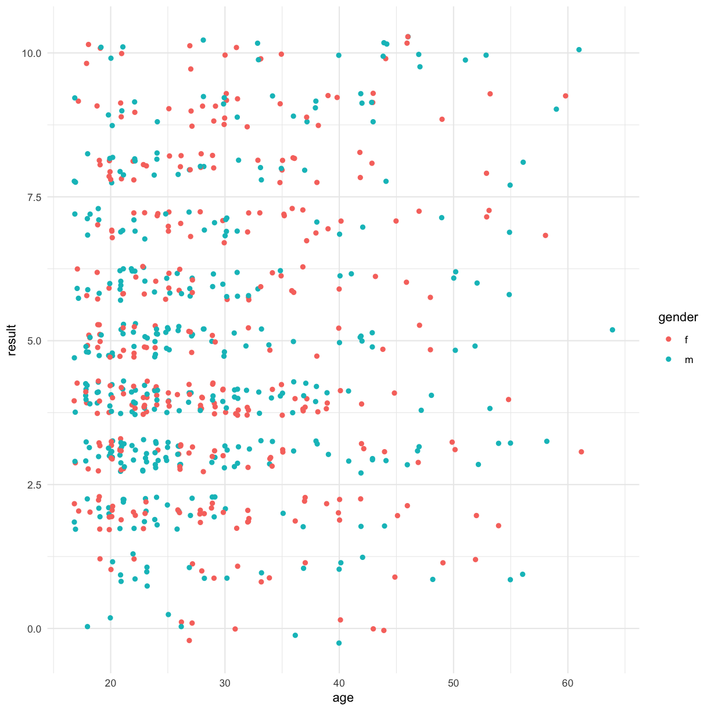

Is there a correlation between age and result? Lets visualise a linear model fit

~~~
ggplot(data = autism.data, aes(x = age, y = result, color=gender)) + geom_point() + theme_minimal()  + geom_smooth(method="lm")
~~~
{: .language-r}

~~~
Warning: Removed 2 rows containing non-finite values (stat_smooth).
~~~
{: .error}

~~~
Warning: Removed 2 rows containing missing values (geom_point).
~~~
{: .error}

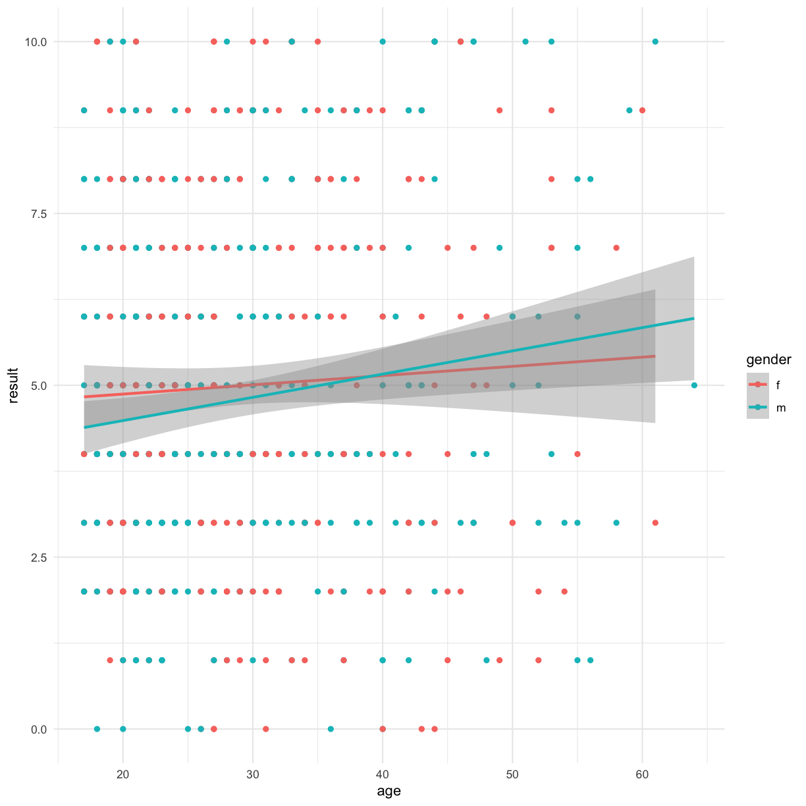

## Multi-panel figures
We can also use facets to split our figure by factor:

~~~
ggplot(data = autism.data, aes(x = age, y = result, color=gender)) + geom_point() + theme_bw()  + geom_smooth(method="lm") + facet_grid(~gender)
~~~
{: .language-r}

~~~
Warning: Removed 2 rows containing non-finite values (stat_smooth).
~~~
{: .error}

~~~
Warning: Removed 2 rows containing missing values (geom_point).
~~~
{: .error}

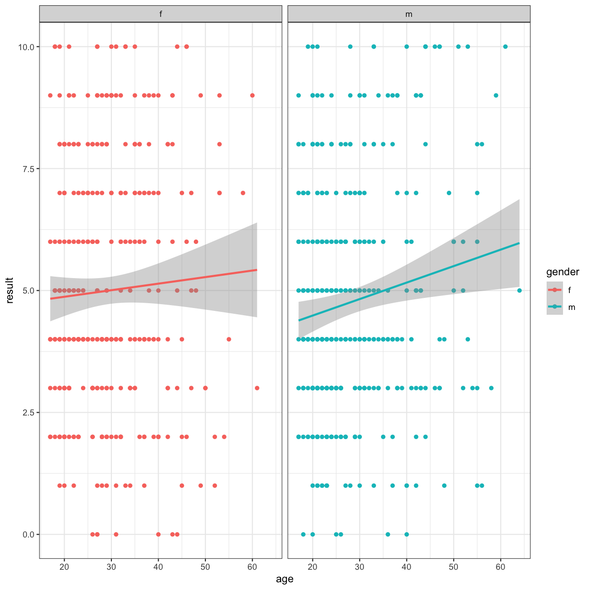

~~~
#
ggplot(data = autism.data, aes(x = age, y = result, color=gender)) + geom_point() + theme_bw()  + geom_smooth(method="lm") + facet_grid(gender~.)
~~~
{: .language-r}

~~~
Warning: Removed 2 rows containing non-finite values (stat_smooth).
Warning: Removed 2 rows containing missing values (geom_point).
~~~
{: .error}

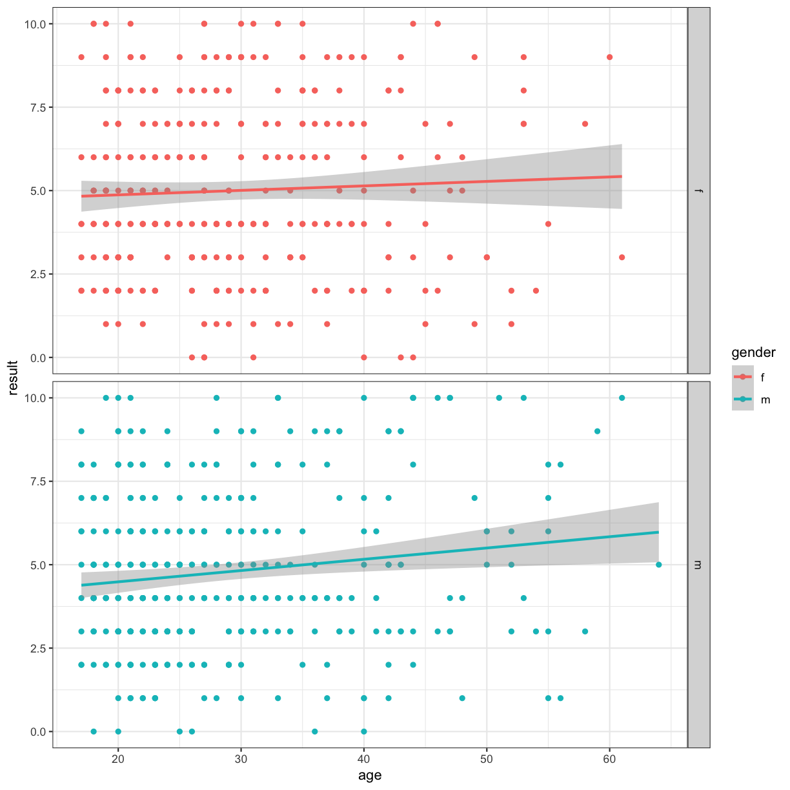

~~~
#
ggplot(data = autism.data, aes(x = age, y = result, color=Class.ASD)) + geom_point() + theme_bw()  + geom_smooth(method="lm") + facet_grid(gender~jaundice)
~~~
{: .language-r}

~~~
Warning: Removed 2 rows containing non-finite values (stat_smooth).
Warning: Removed 2 rows containing missing values (geom_point).
~~~
{: .error}

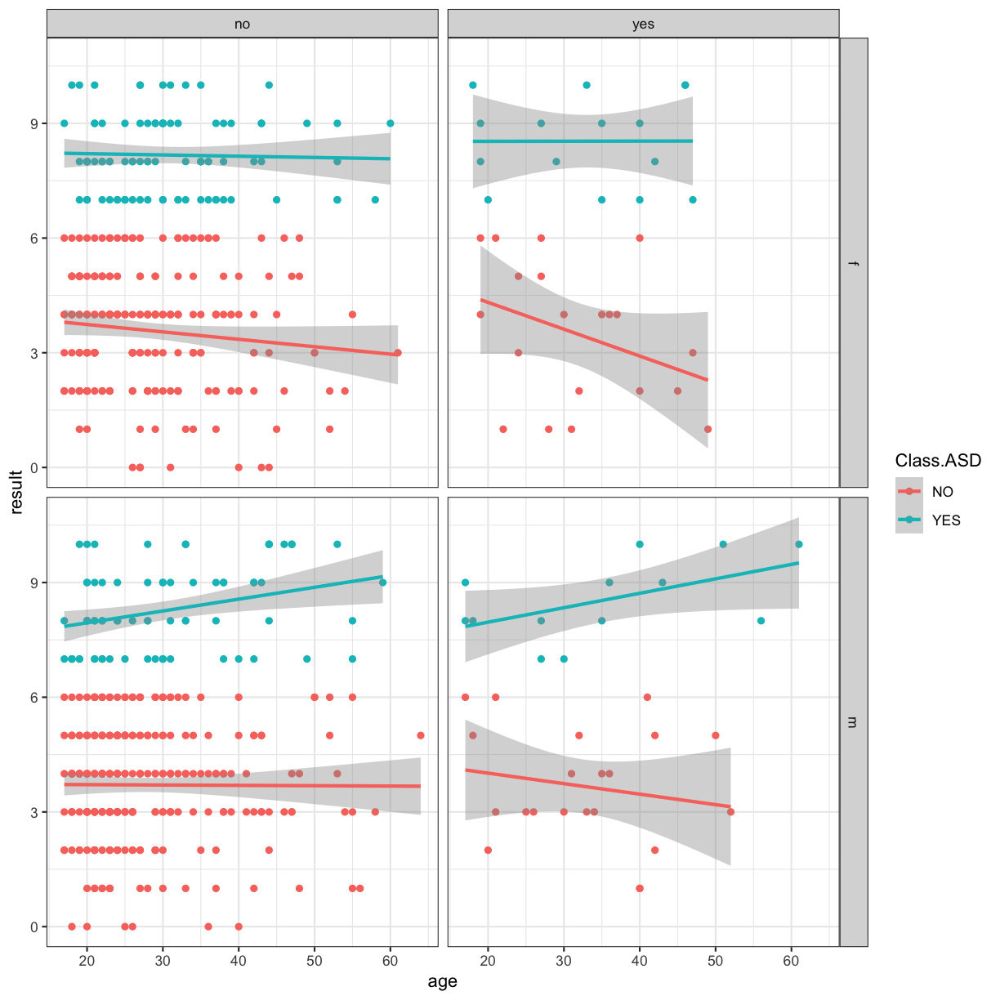

## Adding titles and labels

~~~
#
ggplot(data = autism.data, aes(x = age, y = result, color=Class.ASD)) + geom_point() + theme_bw()  + geom_smooth(method="lm") + facet_grid(gender~jaundice) + labs(
  x = "Age",
  y = "Result score",
  title = "Autism dataset exploration",
  subtitle = "Jaundice status:",
  color = "Austism diagnosis"
)
~~~
{: .language-r}

~~~
Warning: Removed 2 rows containing non-finite values (stat_smooth).
~~~
{: .error}

~~~
Warning: Removed 2 rows containing missing values (geom_point).
~~~
{: .error}

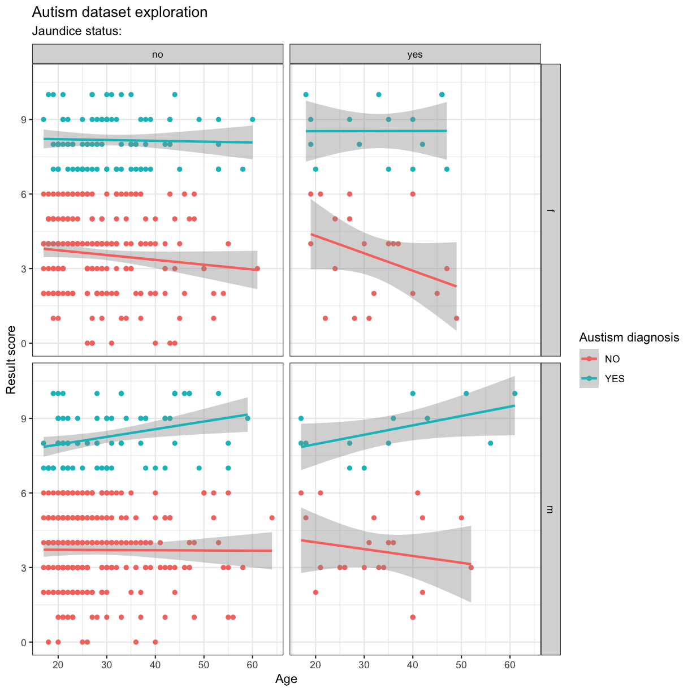

## Interlude: gathering and spreading

There are two main functions in `tidyr`. These are `gather()` and `spread()`, and they allow for the conversion between long and wide data formats.

Wide format are more natural for human reading. This is where we have samples in rows and variables in columns. In contrast, the long format is key-value pairing for each sample and variable. 

## gather()
The `gather()` function transform your data from wide to long format. To do so, we need to provide `gather()` with the name of the new column where all the variable names will be presented with the `key` argument, the name of the new column where the values will be stored with teh `value` argument and the names of any columns you want to include (or exclude) in the gathering process.

~~~
autism.data %>%
  select(A1_Score, A2_Score, A3_Score, A4_Score, A5_Score, A6_Score, A7_Score, A8_Score, A9_Score, A10_Score) %>%
  gather(key = "AQ", value = "score") %>%
  head()
~~~
{: .language-r}

~~~
        AQ score
1 A1_Score     1
2 A1_Score     1
3 A1_Score     1
4 A1_Score     1
5 A1_Score     1
6 A1_Score     1
~~~
{: .output}

We can exclude certain variables from the gathering process. For example if we didn't want to gather the PatientID and also the Class/ASD variables, we can note these in the `gather()` function

~~~
autism.data %>%
  select(pids, Class.ASD, A1_Score, A2_Score, A3_Score, A4_Score, A5_Score, A6_Score, A7_Score, A8_Score, A9_Score, A10_Score) %>%
  gather(key = "AQ", value = "score", -pids, -Class.ASD) %>%
  head()
~~~
{: .language-r}

~~~
         pids Class.ASD       AQ score
1 PatientID_1        NO A1_Score     1
2 PatientID_2        NO A1_Score     1
3 PatientID_3       YES A1_Score     1
4 PatientID_4        NO A1_Score     1
5 PatientID_5        NO A1_Score     1
6 PatientID_6       YES A1_Score     1
~~~
{: .output}

## spread()
The `spread()` function transforms from long to wide format.

~~~
autism.data %>%
  select(pids, Class.ASD, A1_Score, A2_Score, A3_Score, A4_Score, A5_Score, A6_Score, A7_Score, A8_Score, A9_Score, A10_Score) %>%
  gather(key = "AQ", value = "score", -pids, -Class.ASD) -> longdata

longdata %>%
  spread(AQ, score) %>%
  head()
~~~
{: .language-r}

~~~
           pids Class.ASD A1_Score A10_Score A2_Score A3_Score A4_Score
1   PatientID_1        NO        1         0        1        1        1
2  PatientID_10       YES        1         0        1        1        1
3 PatientID_100        NO        0         0        0        0        0
4 PatientID_101        NO        0         0        1        1        0
5 PatientID_102        NO        1         0        0        0        0
6 PatientID_103        NO        1         1        0        0        0
  A5_Score A6_Score A7_Score A8_Score A9_Score
1        0        0        1        1        0
2        0        1        1        1        1
3        0        0        0        0        1
4        0        0        0        1        0
5        0        0        0        1        0
6        0        0        0        0        1
~~~
{: .output}

Using gather and spread can be especially useful when visualising data:

~~~
autism.data %>% filter(id %in% seq(1,9)) %>% 
  select(id, Class.ASD,ends_with("Score")) %>%
  gather(key = "AQ", value = "score", -id, -Class.ASD) %>%
  mutate( AQ = str_remove(AQ, "_Score"))%>%
  mutate( id = as.factor(id)) %>%
  ggplot(aes(x = id, y = score, col = AQ)) + geom_jitter(height = 0.4,width = 0.3) +scale_color_brewer(palette = "Paired") + theme_minimal() + labs(
  x = "Subject ID",
  y = "AQ score",
  title = "Autism dataset exploration",
  color = "AQ"
)
~~~
{: .language-r}

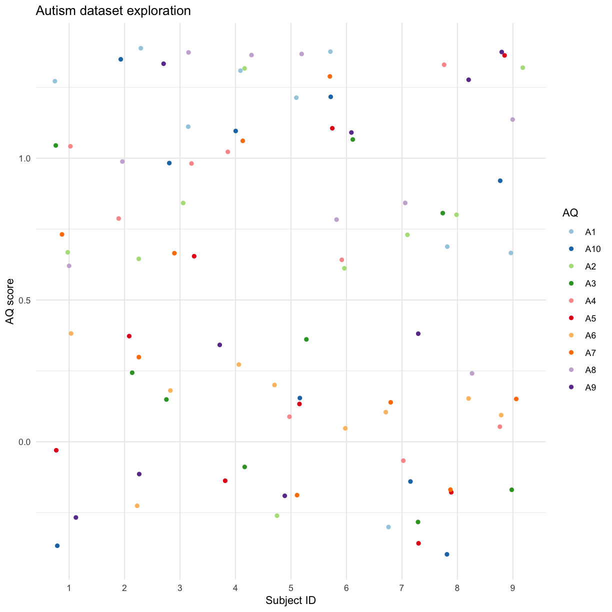

There are a LOT of other types of graphs and modifications the ggplot library supports - see the [documentation](https://ggplot2.tidyverse.org/index.html) and [cheatsheets](https://github.com/rstudio/cheatsheets/blob/master/data-visualization-2.1.pdf) for more details and ideas. 

Note: part of the text of this module has been adapted from the Software Carpentry [R for Reproducible Scientific Analysis:Creating Publication-Quality Graphics with ggplot2](http://swcarpentry.github.io/r-novice-gapminder/08-plot-ggplot2/index.html) material. 
