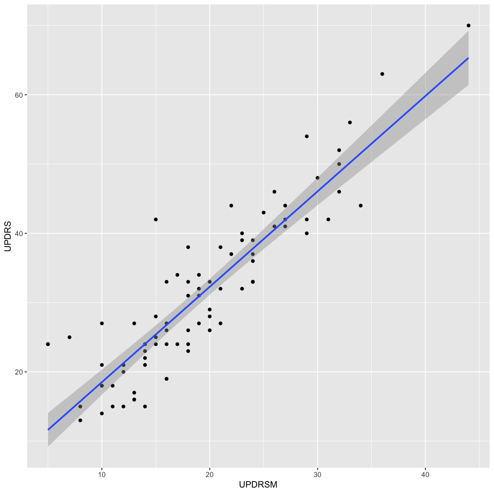
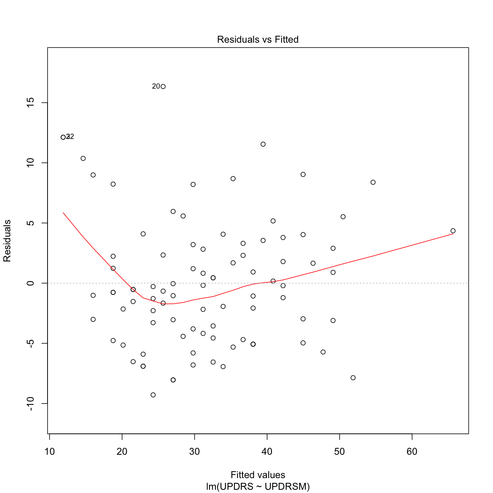

---
# Please do not edit this file directly; it is auto generated.
# Instead, please edit 10-BMC_R_Day3_B.md in _episodes_rmd/
title: "Data and statistical analysis"
author: "Nicholas Ho, Darya Vanichkina, Richard Morris, Maryam Montazerolghaem"
keypoints:
- R has a large community of developers creating power tools for data and statistical analysis
objectives: 
- Introduction into using R for statistical analysis and visualisation
questions: Using R for data and statistical analysis
source: Rmd
subtitle: Day 3
teaching: 60
exercises: 25
---

## Data and statistical analysis

We have previously shown you how to wrangle your data into the right shape with the tidyverse. Now onto hypothesis testing and statistical analysis. 

Our aim here is not to teach you statistics, but how to use R to perform the most popular statistical analysis on your data.

The data for this session can be [downloaded from here](https://raw.githubusercontent.com/Sydney-Informatics-Hub/lessonbmc/gh-pages/_episodes_rmd/data/gait_clean.csv). This is a selection of datapoints from a database of demographic and clinical measurements of Parkinson's patients and controls. More information about this dataset can be found at http://physionet.org/physiobank/database/gaitpdb/.

Please download this .csv file into your working directory's `data` folder.

~~~
library(tidyverse)

gait <- read.csv("data/gait_clean.csv", 
                 header = TRUE,
                 row.names = 1)

# another way to read in this CSV file is to use the URL option in read.csv()
gait <- read.csv("https://raw.githubusercontent.com/Sydney-Informatics-Hub/lessonbmc/gh-pages/_episodes_rmd/data/gait_clean.csv", 
                 header = TRUE,
                 row.names = 1)

# let's inspect the data
summary(gait)
~~~
{: .language-r}

~~~
       ID     Study   Group      Subjnum         Gender        Age      
 GaCo04 : 1   Ga:31   CO:10   Min.   : 1.00   female:35   Min.   :36.0  
 GaCo06 : 1   Ju:29   PD:83   1st Qu.:11.00   male  :58   1st Qu.:61.0  
 GaCo10 : 1   Si:33           Median :17.00               Median :67.0  
 GaCo11 : 1                   Mean   :18.63               Mean   :66.1  
 GaCo12 : 1                   3rd Qu.:27.00               3rd Qu.:71.0  
 GaCo13 : 1                   Max.   :40.00               Max.   :86.0  
 (Other):87                                                             
     Height          Weight         HoehnYahr       UPDRS   
 Min.   :1.500   Min.   : 47.00   Min.   :0.0   Min.   : 0  
 1st Qu.:1.600   1st Qu.: 65.00   1st Qu.:2.0   1st Qu.:19  
 Median :1.680   Median : 72.00   Median :2.0   Median :27  
 Mean   :1.674   Mean   : 72.04   Mean   :2.0   Mean   :28  
 3rd Qu.:1.730   3rd Qu.: 80.00   3rd Qu.:2.5   3rd Qu.:38  
 Max.   :1.860   Max.   :101.00   Max.   :3.0   Max.   :70  
                                                            
     UPDRSM           TUAG          Speed_01    
 Min.   : 0.00   Min.   : 7.16   Min.   :0.413  
 1st Qu.:12.00   1st Qu.: 9.70   1st Qu.:0.935  
 Median :17.00   Median :10.83   Median :1.107  
 Mean   :17.29   Mean   :11.28   Mean   :1.073  
 3rd Qu.:24.00   3rd Qu.:12.67   3rd Qu.:1.212  
 Max.   :44.00   Max.   :25.25   Max.   :1.515  
                                                
~~~
{: .output}

## Correlation

We're interested to see if there's any correlation between two clinical measures: UPDRS (Unified Parkinson's Disease Rating Scale) and TUAG (Timed Up And Go Test)

~~~
cor(gait$UPDRS, gait$TUAG, method = "spearman")
~~~
{: .language-r}

~~~
[1] 0.4321055
~~~
{: .output}

~~~
ggplot(gait, aes(x = TUAG, y = UPDRS)) +
  geom_point()
~~~
{: .language-r}

> ## Section quiz
> 1. What's the Spearman's rank correlation coefficient between UPDRS and UPDRSM? 
> {: .source}
> > ## Solution
> > 1. 
> > ~~~
> > cor(gait$UPDRS, gait$UPDRSM, method = "spearman")
> > ~~~
> > {: .output}
> {: .solution}
{: .challenge}

We're interested to see if there's any correlation between any of the clinical variables in the dataset. Let's explore this by generating a correlation plot.

~~~
# please install corrplot prior to running the below code by running: install.packages("corrplot")
library(corrplot)

# keep the clinical variables
gait_clin <- gait %>%
  select(HoehnYahr, UPDRS, UPDRSM, TUAG)

# create a correlation matrix of the clinical markers using Spearman correlation
correlations <- cor(gait_clin, method = "spearman")

# create the correlation plot
corrplot(correlations, method = "color")
~~~
{: .language-r}

## Hypothesis testing 

Let's say we want to simply compare the `TUAG` score between `Group` by using the 2-sample t-test. Our null hypothesis is that there is no difference between the mean `TUAG` of the Parkinson's and Control participants. By default in R, the `t.test()` function will perform Welch's 2-sample t-test. We can plot this with a violin plot

~~~
t.test(TUAG ~ Group, data = gait)
~~~
{: .language-r}

~~~

	Welch Two Sample t-test

data:  TUAG by Group
t = -6.9918, df = 27.164, p-value = 1.572e-07
alternative hypothesis: true difference in means is not equal to 0
95 percent confidence interval:
 -4.075476 -2.226572
sample estimates:
mean in group CO mean in group PD 
         8.46500         11.61602 
~~~
{: .output}

~~~
# Let's visualise this data
ggplot(gait, aes(y=TUAG, x = Group)) + 
  geom_violin() 
~~~
{: .language-r}

~~~
# have a bit of fun and change the plot to the Wall St Journal's style
library(ggthemes)
ggplot(gait, aes(y=TUAG, x = Group,fill = Group)) + 
  geom_violin() + 
  theme_wsj()
~~~
{: .language-r}
> ## Section quiz
> 1. Perform the Welch 2-sample t-test for TUAG by gender? Generate violin plots of this.
> {: .source}
> > ## Solution
> > 1. 
> > ~~~
> > t.test(TUAG ~ Gender, data = gait)
> > ggplot(gait, aes(y=TUAG, x = Group)) + geom_violin() 
> > ~~~
> > {: .output}
> {: .solution}
{: .challenge}

We can perform the non-parametric Wilcoxon-Mann-Whitney Test. Here the null hypothesis is that the distributions of the two groups are the same.

~~~
wilcox.test(TUAG ~ Group, data = gait)
~~~
{: .language-r}

~~~

	Wilcoxon rank sum test with continuity correction

data:  TUAG by Group
W = 80, p-value = 3.345e-05
alternative hypothesis: true location shift is not equal to 0
~~~
{: .output}

We can then perform an ANOVA using the `Study` grouping of patients. Here, we are testing the null hypothesis that the mean `TUAG` is the same for all groups.

~~~
aov_study <- aov(TUAG ~ Study, data = gait)
summary(aov_study)
~~~
{: .language-r}

~~~
            Df Sum Sq Mean Sq F value Pr(>F)
Study        2   20.7  10.355   1.348  0.265
Residuals   90  691.1   7.679               
~~~
{: .output}

~~~
ggplot(gait, aes(y=TUAG, x = Study)) + 
  geom_violin() 
~~~
{: .language-r}

Let's assume that the ANOVA did show difference in means between groups. We can do post-hoc tests. For example, we can perform multiple pairwise-comparison between the means of groups using Tukey Honest Significant Differences

~~~
TukeyHSD(aov_study)
~~~
{: .language-r}

~~~
  Tukey multiple comparisons of means
    95% family-wise confidence level

Fit: aov(formula = TUAG ~ Study, data = gait)

$Study
            diff        lwr      upr     p adj
Ju-Ga  1.1373192 -0.5687206 2.843359 0.2557625
Si-Ga  0.2999316 -1.3518231 1.951686 0.9020543
Si-Ju -0.8373877 -2.5182543 0.843479 0.4638330
~~~
{: .output}

R has a variety of statistical tests available. Google is your best friend here.

## Simple linear regression

Let's say that for the Parksinson's patients, we want to make a model to predict `UPDRS` score using the `UPDRSM` 

~~~
gait_pd <- gait %>%
  filter(Group == "PD")
~~~
{: .language-r}

~~~
Warning: package 'bindrcpp' was built under R version 3.4.4
~~~
{: .error}

~~~
# Let's plot this first
ggplot(gait_pd, aes(x = UPDRSM, y = UPDRS)) +
  geom_point() +
  geom_smooth(method = 'lm', se = TRUE)
~~~
{: .language-r}

Fit a linear regression predicting UPDRS using UPDRSM, and look at the summary of the results

~~~
gait_pd_slr <- lm(UPDRS ~ UPDRSM, data = gait_pd)
summary(gait_pd_slr)
~~~
{: .language-r}

~~~

Call:
lm(formula = UPDRS ~ UPDRSM, data = gait_pd)

Residuals:
    Min      1Q  Median      3Q     Max 
-9.0197 -4.2161 -0.5118  2.8493 16.6033 

Coefficients:
            Estimate Std. Error t value Pr(>|t|)    
(Intercept)  4.74208    1.57227   3.016  0.00342 ** 
UPDRSM       1.37698    0.07588  18.147  < 2e-16 ***
---
Signif. codes:  0 '***' 0.001 '**' 0.01 '*' 0.05 '.' 0.1 ' ' 1

Residual standard error: 5.294 on 81 degrees of freedom
Multiple R-squared:  0.8026,	Adjusted R-squared:  0.8001 
F-statistic: 329.3 on 1 and 81 DF,  p-value: < 2.2e-16
~~~
{: .output}

~~~
gait_pd_slr$coefficients
~~~
{: .language-r}

~~~
(Intercept)      UPDRSM 
   4.742081    1.376976 
~~~
{: .output}

~~~
plot(gait_pd_slr)
~~~
{: .language-r}

What if we now include `Age` in our model

~~~
gait_pd_mlr <- lm(UPDRS ~ UPDRSM + Age, data = gait_pd)
summary(gait_pd_mlr)
~~~
{: .language-r}

~~~

Call:
lm(formula = UPDRS ~ UPDRSM + Age, data = gait_pd)

Residuals:
    Min      1Q  Median      3Q     Max 
-9.5340 -4.2028 -0.5694  2.6783 16.5024 

Coefficients:
            Estimate Std. Error t value Pr(>|t|)    
(Intercept) -0.29331    4.79490  -0.061    0.951    
UPDRSM       1.39411    0.07732  18.030   <2e-16 ***
Age          0.07175    0.06456   1.111    0.270    
---
Signif. codes:  0 '***' 0.001 '**' 0.01 '*' 0.05 '.' 0.1 ' ' 1

Residual standard error: 5.286 on 80 degrees of freedom
Multiple R-squared:  0.8056,	Adjusted R-squared:  0.8007 
F-statistic: 165.7 on 2 and 80 DF,  p-value: < 2.2e-16
~~~
{: .output}

~~~
gait_pd_mlr$coefficients
~~~
{: .language-r}

~~~
(Intercept)      UPDRSM         Age 
 -0.2933059   1.3941070   0.0717548 
~~~
{: .output}

~~~
plot(gait_pd_mlr)
~~~
{: .language-r}

## Visualisation with PCA

We will use PCA and plot the first 2 Principal Components to observe the variance in a microarray dataset. This is a famous dataset from 1999 where 27 acute lymphoblatic leukaemia (ALL) and 11 acute myeloid leukaemia (AML) patient's gene expression data were measured for 3051 genes.

First, we need to install and load up the `multtest` package which comes with the `golub` data.

~~~
# please install multtest prior to running the below code by running: install.packages("multtest")
library(multtest)
data(golub)

# this is a vector of patient's diagnoses. ALL is 0 and AML is 1
table(golub.cl)
~~~
{: .language-r}

~~~
golub.cl
 0  1 
27 11 
~~~
{: .output}

~~~
# let's try PCA in R for visualisation. First, we have to transpose the dataset because we want each patient to be recorded in rows and genes in columns
golub <- t(golub)

# perform PCA with the input data z-scored such that the mean for each gene is 0 and the SD for each gene is 1
pca <- prcomp(golub, scale = TRUE, center = TRUE)

# I'm just interested in plotting the Principal Components. This is in the "x" matrix of the pca object
pca_plotdata <- data.frame(pca$x)

# attach the patient diagnosis as we will be colouring in our plot with this
pca_plotdata <- pca_plotdata %>%
  mutate(samples = as.factor(golub.cl)) 

# plot with ggplot
ggplot(pca_plotdata, aes(x = PC1, y = PC2, colour = samples)) +
  geom_point()
~~~
{: .language-r}

~~~
# inspect the cumulative proportion of variance explained
summary(pca)
~~~
{: .language-r}

~~~
Importance of components%s:
                           PC1      PC2      PC3     PC4      PC5      PC6
Standard deviation     21.7960 16.93278 14.28289 13.3825 11.48963 11.36482
Proportion of Variance  0.1557  0.09398  0.06686  0.0587  0.04327  0.04233
Cumulative Proportion   0.1557  0.24968  0.31655  0.3752  0.41851  0.46085
                            PC7      PC8     PC9    PC10    PC11   PC12
Standard deviation     10.67968 10.08086 9.75473 9.64132 8.70279 8.3228
Proportion of Variance  0.03738  0.03331 0.03119 0.03047 0.02482 0.0227
Cumulative Proportion   0.49823  0.53154 0.56273 0.59319 0.61802 0.6407
                          PC13    PC14   PC15    PC16    PC17    PC18
Standard deviation     8.24560 8.00956 7.9287 7.61089 7.41558 7.27317
Proportion of Variance 0.02228 0.02103 0.0206 0.01899 0.01802 0.01734
Cumulative Proportion  0.66301 0.68403 0.7046 0.72362 0.74165 0.75898
                          PC19    PC20    PC21    PC22    PC23    PC24
Standard deviation     7.10444 6.96890 6.90898 6.78065 6.65938 6.55649
Proportion of Variance 0.01654 0.01592 0.01565 0.01507 0.01454 0.01409
Cumulative Proportion  0.77553 0.79145 0.80709 0.82216 0.83670 0.85079
                         PC25   PC26    PC27    PC28    PC29    PC30
Standard deviation     6.4648 6.4170 6.26913 6.19409 6.12242 6.06556
Proportion of Variance 0.0137 0.0135 0.01288 0.01258 0.01229 0.01206
Cumulative Proportion  0.8645 0.8780 0.89086 0.90344 0.91572 0.92778
                          PC31    PC32    PC33    PC34    PC35    PC36
Standard deviation     5.90103 5.82533 5.77058 5.64872 5.51038 5.44628
Proportion of Variance 0.01141 0.01112 0.01091 0.01046 0.00995 0.00972
Cumulative Proportion  0.93920 0.95032 0.96123 0.97169 0.98164 0.99136
                          PC37      PC38
Standard deviation     5.13284 1.344e-14
Proportion of Variance 0.00864 0.000e+00
Cumulative Proportion  1.00000 1.000e+00
~~~
{: .output}

## Visualisation and clustering with gplots and heatmap.2()

~~~
# please install gplots prior to running the below code by running: install.packages("gplots")
library(gplots)

# my favourite genes are in these columns
favgenes <- c(703,717,766,829,896,1037,1334,1665,1817,1834,2002,2124,2386,2600,2645,2801,2851,2939)

# let's make a heatmap of my favourite genes
heatmap.2(golub[ ,favgenes], 
          trace = "none",
          scale = "column",
          RowSideColors = c(rep("red", 27), rep("blue", 11)),
          dendrogram = "both", 
          col = "bluered")
~~~
{: .language-r}

