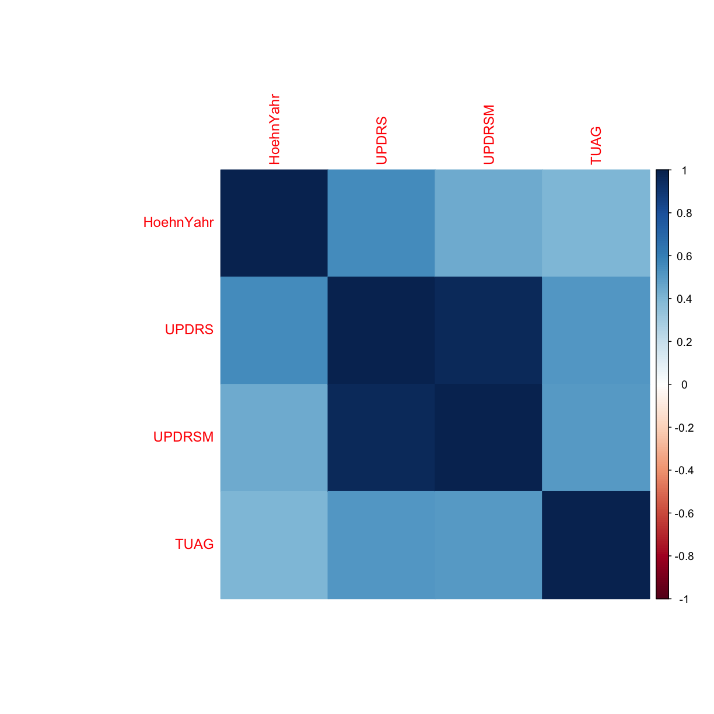
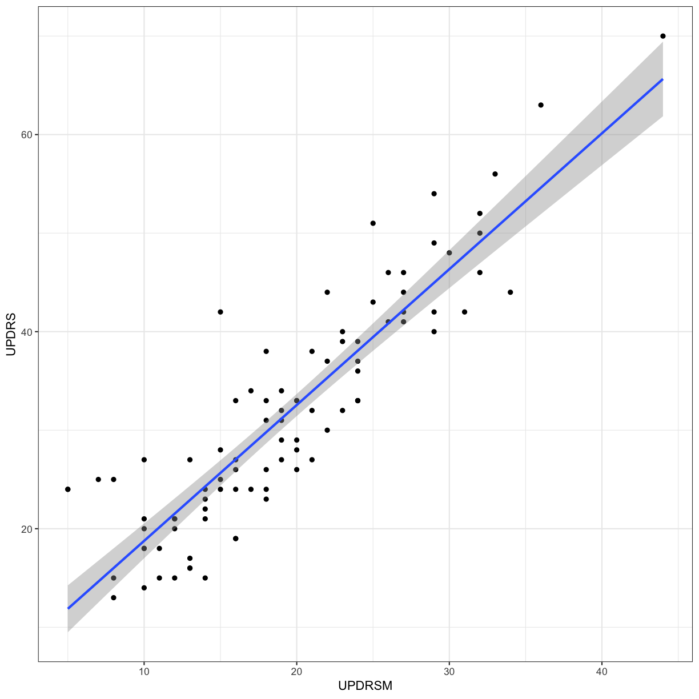

---
# Please do not edit this file directly; it is auto generated.
# Instead, please edit 10-BMC_R_Day3_B.md in _episodes_rmd/
title: "Data and statistical analysis"
author: "Nicholas Ho, Darya Vanichkina"
keypoints:
- R has a large community of developers creating power tools for data and statistical analysis
objectives:
- Introduction into using R for statistical analysis and visualisation
questions: R has most common (and uncommon) statistical tests implemented as libraries
source: Rmd
subtitle: Day 3
teaching: 60
exercises: 25
---

## Data and statistical analysis

We have previously shown you how to wrangle your data into the right shape with the tidyverse. Now we will use core R libraries to perform hypothesis testing and statistical analysis.

Our aim here is not to teach you statistics, but how to use R to perform the most popular statistical analysis on your data. If you'd like a statistical consultation for your specific project, please [contact Sydney Informatics Hub's statistics team](https://informatics.sydney.edu.au/help/) (select the "less than a day" of help option).

> *To consult the statistician after an experiment is finished is often merely to ask him to conduct a post mortem examination. He can perhaps say what the experiment died of*
> - Ronald Fisher 1938

The data for this session can be [downloaded from here](https://raw.githubusercontent.com/Sydney-Informatics-Hub/lessonbmc/gh-pages/_episodes_rmd/data/gait_clean.csv). This is a selection of datapoints from a database of demographic and clinical measurements of Parkinson's patients and controls. More information about this dataset can be found at http://physionet.org/physiobank/database/gaitpdb/.

Please download this .csv file into your working directory's `data` folder.

~~~
library(tidyverse)

gait <- read_csv("data/gait_clean.csv",  na  = "NaN")

# another way to read in this CSV file is to use the URL option in read.csv()
gait <- read_csv(url("https://raw.githubusercontent.com/Sydney-Informatics-Hub/lessonbmc/gh-pages/_episodes_rmd/data/gait_clean.csv"), na = "NaN")

# clean up the names to not have spaces
names(gait) <- make.names(names(gait), unique=TRUE)

# let's inspect the data
summary(gait)
~~~
{: .language-r}

~~~
      ID               Study              Group              Subjnum     
 Length:166         Length:166         Length:166         Min.   : 1.00  
 Class :character   Class :character   Class :character   1st Qu.: 8.25  
 Mode  :character   Mode  :character   Mode  :character   Median :16.00  
                                                          Mean   :16.47  
                                                          3rd Qu.:23.75  
                                                          Max.   :40.00  
                                                                         
    Gender               Age        Height..meters.    Weight..kg.    
 Length:166         Min.   :36.00   Min.   :  1.450   Min.   : 47.00  
 Class :character   1st Qu.:59.00   1st Qu.:  1.655   1st Qu.: 64.00  
 Mode  :character   Median :65.00   Median :  1.740   Median : 72.00  
                    Mean   :65.14   Mean   : 57.634   Mean   : 72.56  
                    3rd Qu.:71.00   3rd Qu.:160.000   3rd Qu.: 80.00  
                    Max.   :86.00   Max.   :185.000   Max.   :105.00  
                                    NA's   :3         NA's   :3       
   HoehnYahr         UPDRS           UPDRSM           TUAG      
 Min.   :0.000   Min.   : 0.00   Min.   : 0.00   Min.   : 6.23  
 1st Qu.:2.000   1st Qu.: 1.00   1st Qu.: 1.00   1st Qu.: 8.94  
 Median :2.000   Median :24.00   Median :14.00   Median :10.32  
 Mean   :1.892   Mean   :21.47   Mean   :13.18   Mean   :10.92  
 3rd Qu.:2.500   3rd Qu.:33.00   3rd Qu.:21.00   3rd Qu.:11.99  
 Max.   :3.000   Max.   :70.00   Max.   :44.00   Max.   :36.34  
 NA's   :55      NA's   :31      NA's   :31      NA's   :13     
 Speed_01..m.sec.    Speed_10     
 Min.   :0.360    Min.   :0.2280  
 1st Qu.:1.013    1st Qu.:0.7930  
 Median :1.144    Median :0.9550  
 Mean   :1.125    Mean   :0.9675  
 3rd Qu.:1.261    3rd Qu.:1.1890  
 Max.   :1.542    Max.   :1.5320  
 NA's   :1        NA's   :146     
~~~
{: .output}

## Correlation

Let's explore whether there is correlation between two clinical measures: UPDRS (Unified Parkinson's Disease Rating Scale) and TUAG (Timed Up And Go Test). We will use the Spearman rank correlation here (as opposed to the default method, "pearson"). Remember that the Spearman correlation is useful when there is a monotonic relationship between two continuous or ordinal variables, i.e. the two variables tend change together, but not necessarily at a constant rate (if the rate is expected to be constant, use Pearson).

~~~
cor(gait$UPDRS, gait$TUAG, method = "spearman", use="pairwise.complete.obs")
~~~
{: .language-r}

~~~
[1] 0.5136702
~~~
{: .output}

~~~
ggplot(gait, aes(x = TUAG, y = UPDRS)) +
  geom_point() + theme_bw()
~~~
{: .language-r}

> ## Section quiz
> 1. What's the Spearman's rank correlation coefficient between UPDRS and UPDRSM?
> {: .source}
> > ## Solution
> > 1.
> > ~~~
> > cor(gait$UPDRS, gait$UPDRSM, method = "spearman", use="pairwise.complete.obs")
> > ~~~
> > {: .output}
> {: .solution}
{: .challenge}

We're interested to see if there's any correlation between any of the clinical variables in the dataset. Let's explore this by generating a correlation plot.

~~~
# please install corrplot prior to running the below code by running: install.packages("corrplot")
library(corrplot)

# keep the clinical variables
gait_clin <- gait %>%
  select(HoehnYahr, UPDRS, UPDRSM, TUAG)

# create a correlation matrix of the clinical markers using Spearman correlation
correlations <- cor(gait_clin, method = "spearman" ,use="pairwise.complete.obs")

# create the correlation plot
corrplot(correlations, method = "color")
~~~
{: .language-r}

## Hypothesis testing

### 2 samples: t-test (parametric)
Let's say we want to simply compare the mean of the `TUAG` score between `Group` by using the 2-sample t-test This assumes that the variable in question is normally distributed in the two groups (although it is also relatively robust when this is not the case thanks to the Central Limit Theorem with sample sizes greater than 30).  

Our null hypothesis is that there is no difference between the mean `TUAG` of the Parkinson's and Control participants. By default in R, the `t.test()` function will perform Welch's 2-sample t-test. We can visualise the distribution of this data using a violin plot:

~~~
t.test(TUAG ~ Group, data = gait)
~~~
{: .language-r}

~~~

	Welch Two Sample t-test

data:  TUAG by Group
t = -5.9645, df = 125.22, p-value = 2.339e-08
alternative hypothesis: true difference in means is not equal to 0
95 percent confidence interval:
 -3.680347 -1.846478
sample estimates:
mean in group CO mean in group PD 
        9.292698        12.056111 
~~~
{: .output}

~~~
# Let's visualise this data
ggplot(gait, aes(y=TUAG, x = Group)) +
  geom_violin() + theme_bw()
~~~
{: .language-r}

> ## Section quiz
> 1. Perform the Welch 2-sample t-test for TUAG by gender? Generate violin plots of this.
> {: .source}
> > ## Solution
> > 1.
> > ~~~
> > t.test(TUAG ~ Gender, data = gait)
> > ggplot(gait, aes(y=TUAG, x = Gender, fill = Gender)) + geom_violin() +theme_bw()
> > ~~~
> > {: .output}
> {: .solution}
{: .challenge}

### 2 samples: Wilcoxon-Mann-Whitney (non-parametric)
The Mann–Whitney U test, also called the Mann–Whitney–Wilcoxon, Wilcoxon rank-sum test, or Wilcoxon–Mann–Whitney test - is sometimes preferred to the 2 sample t-test when the distribution cannot be assumed to be normal; for a discussion of whether this is appropriate see [here](http://thestatsgeek.com/2014/04/12/is-the-wilcoxon-mann-whitney-test-a-good-non-parametric-alternative-to-the-t-test/).

Thankfully, performing it in R is easier than trying to figure out if it's appropriate...

Here the null hypothesis is that the two independent samples were selected from populations having a similar distribution (if the samples are dependent, use the Wilcoxon signed-rank test, by specifying the arguement `paired=TRUE`).

~~~
wilcox.test(TUAG ~ Group, data = gait)
~~~
{: .language-r}

~~~

	Wilcoxon rank sum test with continuity correction

data:  TUAG by Group
W = 1122, p-value = 2.172e-10
alternative hypothesis: true location shift is not equal to 0
~~~
{: .output}

### More than 2 comparisons: ANOVA

If we want to explore the relationship between a variable and multiple factors, we can use an ANOVA. Many experiments you've told us about are amenable to this analysis technique, for example determining levels of which miRNA are distinct in cancer vs normal tissue (miRNA1, miRNA2, miRNA3, miRNA4 as factor 1, and cancer vs normal as factor 2); whether the concentration of a compound is distinct in WT vs mutant cell lines at different ages (age1, age2, age3) etc.

#### One-way ANOVA

We can perform an ANOVA using the `Study` grouping of patients and test the null hypothesis that the mean `TUAG` is the same for all groups

~~~
aov_study <- aov(TUAG ~ Study , data = gait)
summary(aov_study)
~~~
{: .language-r}

~~~
             Df Sum Sq Mean Sq F value Pr(>F)  
Study         2   63.6   31.82   2.691 0.0711 .
Residuals   150 1773.7   11.82                 
---
Signif. codes:  0 '***' 0.001 '**' 0.01 '*' 0.05 '.' 0.1 ' ' 1
13 observations deleted due to missingness
~~~
{: .output}

~~~
ggplot(gait, aes(y=TUAG, x = Study)) +
  geom_violin() +
  theme_bw()
~~~
{: .language-r}

#### Two-way ANOVA

We can perform an ANOVA using the `Study` grouping of patients and the `Group`, i.e. whether they are controls or have a PD diagnosis. Here, we are testing the null hypothesis that the mean `TUAG` is the same for all groups.

~~~
aov_study <- aov(TUAG ~ Study + Group, data = gait)
summary(aov_study)
~~~
{: .language-r}

~~~
             Df Sum Sq Mean Sq F value   Pr(>F)    
Study         2   63.6   31.82   3.108   0.0476 *  
Group         1  248.2  248.25  24.248 2.22e-06 ***
Residuals   149 1525.4   10.24                     
---
Signif. codes:  0 '***' 0.001 '**' 0.01 '*' 0.05 '.' 0.1 ' ' 1
13 observations deleted due to missingness
~~~
{: .output}

~~~
ggplot(gait, aes(y=TUAG, x = Study)) +
  geom_violin() +
  theme_bw() +
  facet_grid(~Group)
~~~
{: .language-r}

We can also code for more complex designs, where we expect `Height` and `Weight` to not affect the mean `TUAG` score independently (i.e. code for an interaction term).

~~~
names(gait)
~~~
{: .language-r}

~~~
 [1] "ID"               "Study"            "Group"           
 [4] "Subjnum"          "Gender"           "Age"             
 [7] "Height..meters."  "Weight..kg."      "HoehnYahr"       
[10] "UPDRS"            "UPDRSM"           "TUAG"            
[13] "Speed_01..m.sec." "Speed_10"        
~~~
{: .output}

~~~
aov_study2 <- aov(TUAG ~ Age + Height..meters. + Weight..kg. + Height..meters.:Weight..kg., data = gait)
summary(aov_study2)
~~~
{: .language-r}

~~~
                             Df Sum Sq Mean Sq F value   Pr(>F)    
Age                           1  191.3  191.28  19.354 2.12e-05 ***
Height..meters.               1    8.3    8.32   0.842    0.360    
Weight..kg.                   1    9.4    9.38   0.949    0.332    
Height..meters.:Weight..kg.   1    8.3    8.33   0.843    0.360    
Residuals                   142 1403.4    9.88                     
---
Signif. codes:  0 '***' 0.001 '**' 0.01 '*' 0.05 '.' 0.1 ' ' 1
19 observations deleted due to missingness
~~~
{: .output}

~~~
aov_study3 <- aov(TUAG ~ Age + Height..meters.*Weight..kg., data = gait)
summary(aov_study3)
~~~
{: .language-r}

~~~
                             Df Sum Sq Mean Sq F value   Pr(>F)    
Age                           1  191.3  191.28  19.354 2.12e-05 ***
Height..meters.               1    8.3    8.32   0.842    0.360    
Weight..kg.                   1    9.4    9.38   0.949    0.332    
Height..meters.:Weight..kg.   1    8.3    8.33   0.843    0.360    
Residuals                   142 1403.4    9.88                     
---
Signif. codes:  0 '***' 0.001 '**' 0.01 '*' 0.05 '.' 0.1 ' ' 1
19 observations deleted due to missingness
~~~
{: .output}

Let's assume that the we had sufficient evidence from the ANOVA to reject the null. We would then perform post-hoc tests. For example, we can perform multiple pairwise-comparison between the means of groups using Tukey Honest Significant Differences:

~~~
aov_study <- aov(TUAG ~ Study , data = gait)
TukeyHSD(aov_study)
~~~
{: .language-r}

~~~
  Tukey multiple comparisons of means
    95% family-wise confidence level

Fit: aov(formula = TUAG ~ Study, data = gait)

$Study
            diff       lwr        upr     p adj
Ju-Ga -1.2964508 -3.040312 0.44741045 0.1867481
Si-Ga -1.6172115 -3.303214 0.06879145 0.0631204
Si-Ju -0.3207607 -1.837987 1.19646521 0.8711995
~~~
{: .output}

Many, *many* other post-hoc tests are available in R - if you know you'd like to use a specific test, chances are that R already has a package implemented.

***
## Linear regression

Let's say that for the Parkinson's patients, we want to make a model to predict `UPDRS` score using the `UPDRSM`

~~~
gait_pd <- gait %>%
  filter(Group == "PD")

# Let's plot this first
ggplot(gait_pd, aes(x = UPDRSM, y = UPDRS)) +
  geom_point() +
  geom_smooth(method = 'lm', se = TRUE) +
  theme_bw()
~~~
{: .language-r}

Fit a linear regression predicting UPDRS using UPDRSM, and look at the summary of the results

~~~
gait_pd_slr <- lm(UPDRS ~ UPDRSM, data = gait_pd)
summary(gait_pd_slr)
~~~
{: .language-r}

~~~

Call:
lm(formula = UPDRS ~ UPDRSM, data = gait_pd)

Residuals:
    Min      1Q  Median      3Q     Max 
-9.2820 -4.2972 -0.6608  3.0513 16.3392 

Coefficients:
            Estimate Std. Error t value Pr(>|t|)    
(Intercept)  4.97901    1.53207    3.25  0.00163 ** 
UPDRSM       1.37879    0.07378   18.69  < 2e-16 ***
---
Signif. codes:  0 '***' 0.001 '**' 0.01 '*' 0.05 '.' 0.1 ' ' 1

Residual standard error: 5.359 on 89 degrees of freedom
  (2 observations deleted due to missingness)
Multiple R-squared:  0.7969,	Adjusted R-squared:  0.7946 
F-statistic: 349.2 on 1 and 89 DF,  p-value: < 2.2e-16
~~~
{: .output}

~~~
gait_pd_slr$coefficients
~~~
{: .language-r}

~~~
(Intercept)      UPDRSM 
   4.979012    1.378788 
~~~
{: .output}

~~~
plot(gait_pd_slr)
~~~
{: .language-r}

What if we now include `Age` in our model?

~~~
gait_pd_mlr <- lm(UPDRS ~ UPDRSM + Age, data = gait_pd)
summary(gait_pd_mlr)
~~~
{: .language-r}

~~~

Call:
lm(formula = UPDRS ~ UPDRSM + Age, data = gait_pd)

Residuals:
    Min      1Q  Median      3Q     Max 
-9.8453 -4.1916 -0.5681  2.6996 16.2686 

Coefficients:
            Estimate Std. Error t value Pr(>|t|)    
(Intercept) -0.97473    4.48919  -0.217    0.829    
UPDRSM       1.39551    0.07433  18.775   <2e-16 ***
Age          0.08490    0.06022   1.410    0.162    
---
Signif. codes:  0 '***' 0.001 '**' 0.01 '*' 0.05 '.' 0.1 ' ' 1

Residual standard error: 5.33 on 88 degrees of freedom
  (2 observations deleted due to missingness)
Multiple R-squared:  0.8014,	Adjusted R-squared:  0.7969 
F-statistic: 177.5 on 2 and 88 DF,  p-value: < 2.2e-16
~~~
{: .output}

~~~
gait_pd_mlr$coefficients
~~~
{: .language-r}

~~~
(Intercept)      UPDRSM         Age 
-0.97473294  1.39551286  0.08490291 
~~~
{: .output}

~~~
plot(gait_pd_mlr)
~~~
{: .language-r}

## Visualisation with PCA

We will use PCA and plot the first 2 Principal Components to observe the variance in a microarray dataset. This is a famous dataset from 1999 where 27 acute lymphoblatic leukaemia (ALL) and 11 acute myeloid leukaemia (AML) patient's gene expression data were measured for 3051 genes.

First, we need to install and load up the `multtest` package which comes with the `golub` data.

~~~
library(multtest)
data(golub)

# this is a vector of patient's diagnoses. ALL is 0 and AML is 1
table(golub.cl)
~~~
{: .language-r}

~~~
golub.cl
 0  1 
27 11 
~~~
{: .output}

~~~
# let's try PCA in R for visualisation. First, we have to transpose the dataset because we want each patient to be recorded in rows and genes in columns
golub <- t(golub)

# perform PCA with the input data z-scored such that the mean for each gene is 0 and the SD for each gene is 1
pca <- prcomp(golub, scale = TRUE, center = TRUE)

# I'm just interested in plotting the Principal Components. This is in the "x" matrix of the pca object
pca_plotdata <- data.frame(pca$x)

# attach the patient diagnosis as we will be colouring in our plot with this
pca_plotdata <- pca_plotdata %>%
  mutate(samples = as.factor(golub.cl))

# plot PC1 and PC2 with ggplot
ggplot(pca_plotdata, aes(x = PC1, y = PC2, colour = samples)) +
  geom_point() +
  theme_bw()
~~~
{: .language-r}

~~~
# inspect the cumulative proportion of variance explained by each PC
summary(pca)
~~~
{: .language-r}

~~~
Importance of components:
                           PC1      PC2      PC3     PC4      PC5      PC6
Standard deviation     21.7960 16.93278 14.28289 13.3825 11.48963 11.36482
Proportion of Variance  0.1557  0.09398  0.06686  0.0587  0.04327  0.04233
Cumulative Proportion   0.1557  0.24968  0.31655  0.3752  0.41851  0.46085
                            PC7      PC8     PC9    PC10    PC11   PC12
Standard deviation     10.67968 10.08086 9.75473 9.64132 8.70279 8.3228
Proportion of Variance  0.03738  0.03331 0.03119 0.03047 0.02482 0.0227
Cumulative Proportion   0.49823  0.53154 0.56273 0.59319 0.61802 0.6407
                          PC13    PC14   PC15    PC16    PC17    PC18
Standard deviation     8.24560 8.00956 7.9287 7.61089 7.41558 7.27317
Proportion of Variance 0.02228 0.02103 0.0206 0.01899 0.01802 0.01734
Cumulative Proportion  0.66301 0.68403 0.7046 0.72362 0.74165 0.75898
                          PC19    PC20    PC21    PC22    PC23    PC24
Standard deviation     7.10444 6.96890 6.90898 6.78065 6.65938 6.55649
Proportion of Variance 0.01654 0.01592 0.01565 0.01507 0.01454 0.01409
Cumulative Proportion  0.77553 0.79145 0.80709 0.82216 0.83670 0.85079
                         PC25   PC26    PC27    PC28    PC29    PC30
Standard deviation     6.4648 6.4170 6.26913 6.19409 6.12242 6.06556
Proportion of Variance 0.0137 0.0135 0.01288 0.01258 0.01229 0.01206
Cumulative Proportion  0.8645 0.8780 0.89086 0.90344 0.91572 0.92778
                          PC31    PC32    PC33    PC34    PC35    PC36
Standard deviation     5.90103 5.82533 5.77058 5.64872 5.51038 5.44628
Proportion of Variance 0.01141 0.01112 0.01091 0.01046 0.00995 0.00972
Cumulative Proportion  0.93920 0.95032 0.96123 0.97169 0.98164 0.99136
                          PC37      PC38
Standard deviation     5.13284 1.344e-14
Proportion of Variance 0.00864 0.000e+00
Cumulative Proportion  1.00000 1.000e+00
~~~
{: .output}

~~~
# quickly plot the proportion of variance explained by each component using base R's plotting function
plot(summary(pca)$importance["Proportion of Variance", ])
~~~
{: .language-r}

~~~
# and now, plot the cumulative proportion of variance explained
plot(summary(pca)$importance["Cumulative Proportion", ])
~~~
{: .language-r}

## Clustering and heatmap

~~~
# please install gplots prior to running the below code by running: install.packages("gplots")
library(gplots)

# my favourite genes are in these columns
favgenes <- c(703,717,766,829,896,1037,1334,1665,1817,1834,2002,2124,2386,2600,2645,2801,2851,2939)

# let's make a heatmap of my favourite genes
heatmap.2(golub[ ,favgenes],
          trace = "none",
          scale = "column",
          RowSideColors = c(rep("yellow", 27), rep("darkgreen", 11)),
          dendrogram = "both",
          col = "bluered")
~~~
{: .language-r}

***

## Further reading/links

Several of you have asked about analysing so-called Likert data, i.e situations when you are trying to measure respondents attitudes to a particular question or statement (i.e. "very unsatisfied", "unsatisifed", "neither unsatisifed nor satisfied", "satisfied", "very satisfied") etc.

While we don't have the time to go into details of the complexities of analysing this type of data today, they can be analysed in R. Some ideas on how to do this can be found  [here](https://www.st-andrews.ac.uk/media/capod/students/mathssupport/OrdinalexampleR.pdf), [here](https://stats.idre.ucla.edu/r/dae/ordinal-logistic-regression/), and in [the likert package](https://github.com/jbryer/likert).
