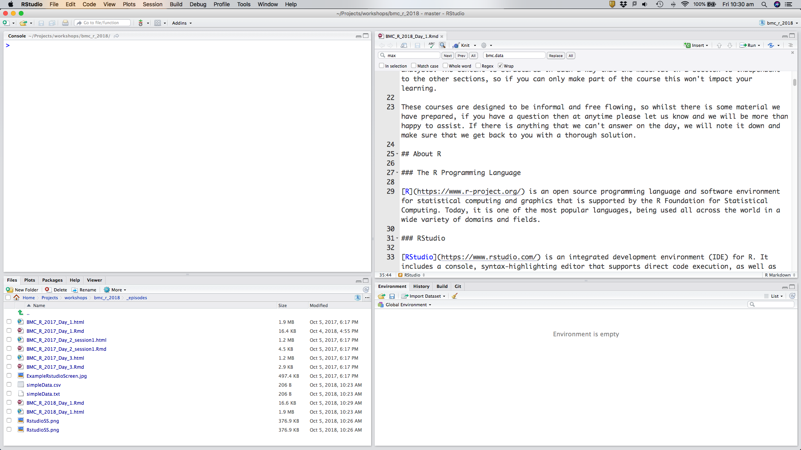

```{r echo=FALSE}
source("../bin/chunk-options.R")
knitr_fig_path("01-")
```

## About R

### The R Programming Language

[R](https://www.r-project.org/) is an open source programming language and software environment for statistical computing and graphics that is supported by the R Foundation for Statistical Computing. Today, it is one of the most popular languages, being used all across the world in a wide variety of domains and fields.

### RStudio

[RStudio](https://www.rstudio.com/) is an integrated development environment (IDE) for R. It includes a console, syntax-highlighting editor that supports direct code execution, as well as tools for plotting, history, debugging and workspace management.



### Installation & Setup

First let's set up the Rstudio panes so that everyone is on the same page.

*Tools* -> *Global Options* -> *Pane Layout*

**Top left:** Console

**Top right:** Source

**Bottom left:** Files, Plots, etc

**Bottom right:** Environment, History, etc


### Starting a new R-project

We'll start a new R-project so we can save our progress and relaunch at anytime.

*File* -> *New Project* -> *New Directory* -> *Empty Project*

We'll call our project "introduction_into_r" and save it in, say, "Documents" folder (or "My Documents" for Windows users)

Note that in "Files", you have a new Rproj file.


### Install prerequisites

Below is a set of commands to install and load packages that you will need for the next three days and also sets some options which will make the course run smoothly. Please copy and run the below commands in your R console.

```{r installation, eval=FALSE, message=FALSE}
#  Install the tidyverse and then load it
install.packages("tidyverse", dependencies = TRUE, repos = "https://cran.csiro.au")
library(tidyverse)

options(scipen = 999)
set.seed(2018)
```

The `library` command loads all of the functions in the specified library, in this case tidyverse, into our workspace.
