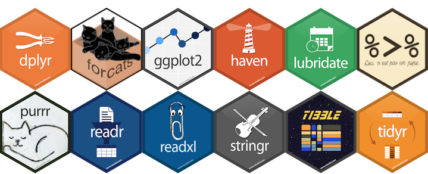

```{r echo=FALSE}
source("../bin/chunk-options.R")
knitr_fig_path("02-")
```
## Data wrangling




So far, we've been using R's base functions to perform our data wrangling and manipulation. 

The advantage of working with R is that R has a large community of developers creating free and powerful tools (called libraries) which we can use. This includes the latest data wrangling, visualisation, statistical testing and machine learning tools.

I would highly encourage you to learn to use the [tidyverse](https://www.tidyverse.org/) collection of data wrangling and visualisation tools. These are excellent tools that allows you to write elegent, legible code that gets your data into the right shape prior to analysis.

```{r, warning=FALSE}
# load tidyverse
library(tidyverse)
```


## haven


haven is a package within the tidyverse that allows you to read in data from different sources. For example, if our autism dataset was saved as an .sav file (SPSS), we can use `haven` to read that in.

TODO - Darya, I'm having trouble reading in the missing values from SPSS. Haven doesn't recognise my SPSS user-specified missing values...Would you know how to get this working? My hack is to run austism.data.spss[which(austism.data.spss == "NA", arr.ind = TRUE)] <- NA but its more complicated and confusing for our students than need be 
```{r, warning=FALSE}
# load haven
library(haven)
#autism.data <- read_spss("data/autism_data.sav") TODO

autism.data <- read.csv(file = "data/autism_pids.csv",
                        header = TRUE,
                        sep = ",")
```


Next, we'll step into one of the most popular tidyverse package called [dplyr](https://dplyr.tidyverse.org/).

## dpylr


`dpylr` allows you to perform some of the most common data manipulation tasks you'll encounter in R. The background of the `dplyr` package is that it is a "grammar" of data manipulation and that its functions are a set of verbs.

You will also notice that the spelling follows British spelling rather than American (Hadley Wickham, author and maintainer of the tidyverse, is from New Zealand), but they can actually be used interchangeably. For example, `summarise()` and `summarize()` perform the same function.

### select()
The `select()` function allows you to pick or remove variables based on their names. Note that you do not use `"` nor `'` to wrap the column names as you would with a base R function

```{r}
# select just the age, gender and result columns from autism.data
selected.autism.data <- select(autism.data, age, gender, result)
head(selected.autism.data)

# select all columns except for ethnicity and country
selected.autism.data <- select(autism.data, -ethnicity, -country)
head(selected.autism.data)
```

The tidyverse allows you to pipe functions together to create a chain to data manipulations. This allows you to redirect the output of one function into another one. Those familiar with bash or *nix will be familiar with piping with `|`. Here, we use `%>%` to pipe.

This makes each step discrete and helps immensely with readability. Also reduces your need to create temporary variables.

```{r}
autism.data %>% select(age, gender, result) %>% head()
```

Or let's make this more legible
```{r}
autism.data %>%
  select(age, gender, result) %>%
  head()
```

Redirect the output of this chain of pipes into a new dataframe
```{r}
autism.data %>%
  select(age, gender, result) -> selected.autism.data
```


### filter()
The `filter()` function allows you to filter rows of your dataset that match some condition. We can also combine this with some of R' base functions. Here, we'll use `head()` to restrict the output number of rows
```{r}
autism.data %>%
  filter(age == 17) %>%
  head()
```

Combine this with the `select()` function to select only the age, gender and country of the 17 year olds in the autism dataset
```{r}
autism.data %>%
  filter(age == 17) %>%
  select(age, gender, country) %>%
  head()
```

What are the counts for countries of the 17 year olds in the autism dataset
```{r}
autism.data %>%
  filter(age == 17) %>%
  select(country) %>%
  table()
```

### arrange()
The `arrange()` function allows you to reorder the rows of your dataset
```{r}
autism.data %>%
  arrange(age) %>%
  head()
```

### mutate()
The `mutate()` function adds new columns for your data set
```{r}
autism.data %>%
  mutate(result_squared = result^2) %>%
  head()
```

You can also use `mutate()` to remove or edit existing columns
```{r}
autism.data %>%
  mutate(age_desc = NULL, # this is to remove the age_desc column
         result = result + 1, # edit the existing result column
         agerank = rank(age)) %>% # add a new column called agerank
  head()
```


### summarise() and group_by()
The `summarise()` function reduces down multiple values into one summary statistic. To do so, we need to tell R which groups we're interested in summarising our data into. To do so, we need to use the `group_by()` function prior to calling `summarise()`
```{r}
autism.data %>%
  group_by(Class.ASD) %>%
  summarise(meanage = mean(age, na.rm = TRUE),
            count = n())
```

You can group by more than one variable
```{r}
autism.data %>%
  group_by(Class.ASD, gender) %>%
  summarise(mean.age = mean(age, na.rm = TRUE),
            max.age = max(age, na.rm = TRUE),
            min.age = min(age, na.rm = TRUE),
            count = n())
```


> ## Section quiz
>
> 1. Create a summary table for mean 'result' after grouping by gender, autism class and family history of autism
>
> 2. Do the same as Q1 and now arrange from the lowest mean 'result' to the highest
>
> {: .source}
>
> > ## Solution
> >
> > 1. Despite the word of the question, we will first 'group_by' and then 'summarise'
> >
> > ~~~
> > autism.data %>% 
> >   group_by(gender, Class.ASD, autism) %>% 
> >   summarise(mean.result = mean(result))
> > ~~~
> > 2. We need to add in an 'arrange' at the end of our command 
> >
> > ~~~
> > autism.data %>% 
> >   group_by(gender, Class.ASD, autism) %>% 
> >   summarise(mean.result = mean(result)) %>%
> >   arrange(mean.result)
> > ~~~
> > {: .output}
> {: .solution}
{: .challenge}

